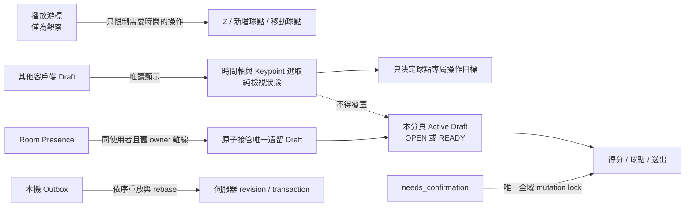

# 標註工作站操作與鎖定關係矩陣

本文件定義標註工作站唯一可接受的操作鎖定關係。UI 按鈕、快捷鍵、page-scoped service、WebSocket outbox 與後端 command handler 必須遵守同一組規則。

## 狀態權責

- `Active Draft`：由 `activeAnnotationRallySnapshot(roomId, deviceSessionId)` 與本分頁 remembered rally 決定。
- `Selection`：只控制目前看到哪個片段、球點或分析項目，不得改變本分頁 Active Draft。
- `READY`：已經有 END、尚未 Enter；仍可修改球點、球員、球種與得分方，也必須可以送出。
- `SUBMITTED／VOIDED`：不可原地修改；若要修改已送出內容必須建立修正版草稿。
- `Abandoned Draft`：明確 owner 已不在 room presence 的未送出 `OPEN/READY`；同一使用者的新
  device session 可在 WS handshake 原子接管，且必須在送出 `connection_ready` 前完成。

## 主要操作矩陣

| 工作狀態                    | Z                              | X/C/V/B 新增       | 已選球點球種/球員 | 移動/刪除球點      | 得分方 `<` `>` `?` | Enter 送出             |
| --------------------------- | ------------------------------ | ------------------ | ----------------- | ------------------ | ------------------ | ---------------------- |
| 無本機草稿 `IDLE`           | 可開始；需要有效游標           | 禁止               | 禁止              | 禁止               | 禁止               | 禁止                   |
| 本機 `OPEN`                 | 可結束；需要有效游標與合法終點 | 可；必須在片段範圍 | 可；不依賴游標    | 可；移動需有效游標 | 可；不會結束片段   | 禁止，一般草稿須先 END |
| 本機 `READY` 未送出         | **禁止再開始**                 | 可；限 END 內      | 可                | 可                 | 可反覆更改         | 可                     |
| 本機修正版 `OPEN`           | 不建立另一片段                 | 可                 | 可                | 可                 | 可                 | 可，進入修正版送出流程 |
| 本機修正版 `READY`          | 不建立另一片段                 | 可                 | 可                | 可                 | 可                 | 可，進入修正版送出流程 |
| 他人 `OPEN` 正在檢視        | 可開始自己的片段               | 禁止修改他人內容   | 禁止              | 禁止               | 禁止               | 禁止                   |
| 明確選取 `READY` 未送出     | **禁止再開始**                 | 可；限 END 內      | 可                | 可                 | 可反覆更改         | 可                     |
| `SUBMITTED/VOIDED` 正在檢視 | 可開始新片段                   | 禁止               | 禁止              | 禁止               | 禁止               | 禁止                   |

## 選取狀態矩陣

| 選取狀態               | Z        | 得分     | 送出     | X 新增                       | C/V/B                | 球點移動/刪除 |
| ---------------------- | -------- | -------- | -------- | ---------------------------- | -------------------- | ------------- |
| 未選球點               | 不變     | 不變     | 不變     | 在游標新增                   | 在游標新增並驗證球序 | 禁止          |
| 選取本機草稿球點       | **不變** | **不變** | **不變** | 仍在游標新增 HIT             | 修改該點並驗證球序   | 對該點操作    |
| 選取歷史/他人球點      | **不變** | **不變** | **不變** | 仍由 Active Draft 與游標決定 | 禁止修改該歷史點     | 禁止          |
| 選取片段 mask/分析結果 | 不變     | 不變     | 不變     | 不變                         | 不變                 | 禁止          |

「不變」表示該操作只依 Active Draft 判斷，絕對不能因時間軸選取而改變。

## 鎖定優先序

| 優先序 | 鎖定來源                                                | 影響範圍                               | 自動解除                                    |
| ------ | ------------------------------------------------------- | -------------------------------------- | ------------------------------------------- |
| 1      | `needs_confirmation` revision 衝突                      | 所有草稿 mutation                      | resync/refetch/rebase 或明確捨棄衝突        |
| 2      | action 本身正在執行                                     | 同一 action，避免重複點擊              | Promise settle；不得鎖住無關 action         |
| 3      | `room.busy` 或 keypoint move 正在 authoritative resolve | 直接球點 mutation                      | ack、錯誤或 watchdog timeout                |
| 4      | 無 Active Draft ownership                               | 該草稿的 mutation                      | 切回本機 Active Draft；不得阻擋開自己的片段 |
| 5      | 游標 stale/gap/seeking                                  | 只限需要時間座標的操作                 | 下一個 authoritative anchor                 |
| 6      | 沒有選取可編輯球點                                      | 只限 move/delete/set event/set actor   | 選取本機草稿球點                            |
| 7      | outbox 有一般 `pending` command                         | 不作全域鎖；後續 command 排隊並 rebase | WS ack/reconnect replay                     |

`無 Active Draft ownership` 不能只看 sessionStorage。若伺服器找到同一使用者唯一一個遺留草稿，
且舊 owner 已離線，必須先接管再計算這一列；禁止把可恢復的 READY 誤判成「他人草稿」。

## 後端不變量

1. 同一 `deviceSessionId` 同時最多一個未送出 ordinary draft，`OPEN` 與 `READY` 都算 active。
2. 不同 device session 可以各自持有 `OPEN`；OPEN 邊界與 Z 狀態不得跨客戶端。
3. `READY` 的 END 已固定。任何獲授權且明確選取它的客戶端都可送出 contact、move、delete、
   ball-event、actor、outcome 與 submit；revision conflict 負責序列化多人修改。
4. `Selection` 永遠不在 wire command 中充當 ownership；command 的 Rally target 由本機 Active Draft 決定。
5. 一般 pending outbox command 必須依序重放並依最新 revision rebase；只有不可自動解決的衝突才進入 `needs_confirmation`。
6. Draft owner 是 Rally 欄位，不再以第一個球點永久推導。接管必須使用 room advisory lock、
   row lock 與 revision increment，並留下 `RECOVER_DRAFT_OWNER` audit operation。
7. 舊 owner 仍在 presence、使用者不同或有多個遺留候選時，不得自動接管。

## 必要回歸案例

- END 進入 READY 後，不選球點與選任意球點時，得分與 Enter 都可用，Z 都不可用。
- READY 後仍可新增、修改、移動與刪除非 service 球點。
- 檢視他人草稿不會覆蓋本機草稿，也不會阻止本分頁按 Z 開始自己的草稿。
- 上一列專指仍在移動 END 的 `OPEN`。明確選取未送出 `READY` 時必須切換成編輯工作區：Z
  禁用，球點／得分／送出啟用；被動 broadcast 不得自行切換。
- 同一裝置 READY 未送出時，UI 與 server 都拒絕第二個 START。
- outbox 尚有一般 pending command 時，可繼續排隊得分、球點修改與 submit；revision conflict 才顯示重新同步。
- WS 斷線、延遲與重連後，Active Draft、selection 與按鈕 availability 收斂到相同結果。
- 同使用者換頁籤／origin／device session 後，唯一且 owner 離線的 READY 草稿會在 handshake
  前接管；UI 必須立即恢復新增、修改、刪除、得分與送出，並維持 Z 禁用。
- 舊 owner 仍在線時，新 session 只能唯讀，不可搶走草稿；有多個遺留草稿時不得猜測。
