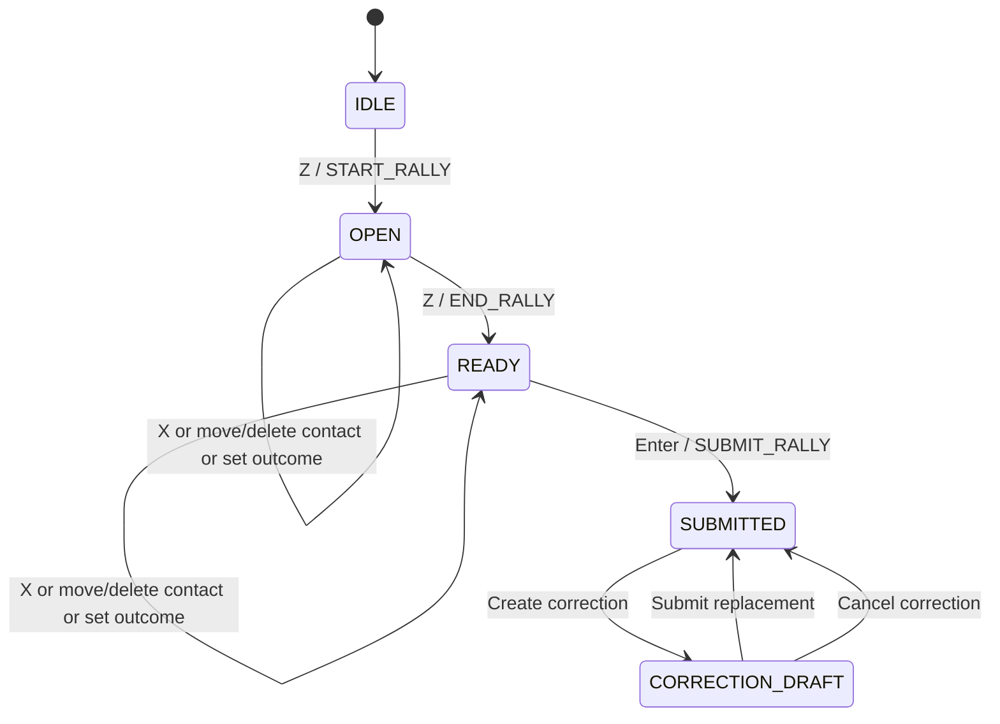
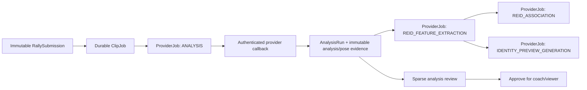
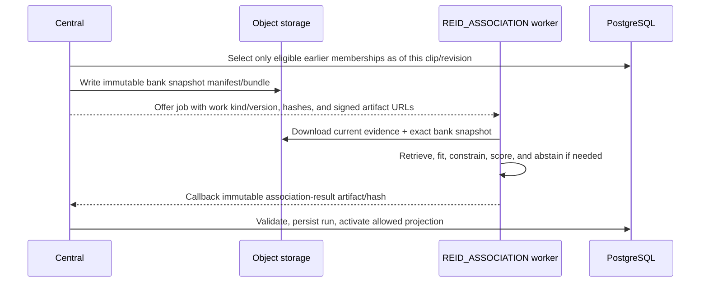
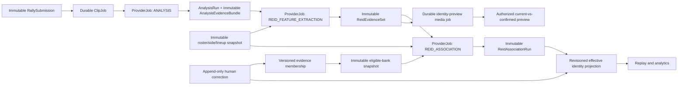

# Annotation, playback, coach replay, and ReID implementation guide

Status: **accepted by the product owner; implementation baseline completed and locally verified; production rollout must be verified independently from live GitOps state**
Last verified: 2026-08-17
Implementation authority: **confirmed on 2026-08-15; ADR 0037 governs the implementation**

This is the single planning document for the two connected workstreams requested by the product
owner:

1. reliable, client-owned annotation, playback, frame navigation, and marking User Flows; and
2. a complete ReID redesign with separate durable jobs, reusable person-pose evidence, VLM/jersey
   evidence, versioned human corrections, rerunnable association, dynamic identity previews, and
   pose-first hitter association.

It consolidates the prior workstation audit, current implementation findings, reported production
failures, the external `volleyball-analysis-engine` branch audit, and the completed hard-cut migration.
It is intentionally detailed so a later agent cannot silently change the requirements or mistake a
research result for an accepted production guarantee.

[`ADR 0037`](./adr/0037-versioned-reid-evidence-and-provider-work.md) defines the new identity model,
every-frame pose evidence, and capability-gated Provider Work architecture. [`ADR 0039`](./adr/0039-reid-hard-cut-and-reprocessing.md)
records the destructive cutover and supersedes ADR 0035 for every active ReID read, write, callback,
export, and worker path. Sections explicitly labeled historical describe why the cutover was required;
they are not compatibility requirements.

Product and contract authorities still take precedence:

- [`SYSTEM_SPEC_V3_2.md`](./SYSTEM_SPEC_V3_2.md)
- [`ADR 0030`](./adr/0030-coalesced-frame-navigation-and-analysis-export.md)
- [`ADR 0031`](./adr/0031-rally-boundaries-and-effective-contact-analysis.md)
- [`ADR 0032`](./adr/0032-reviewed-analysis-and-timeline-side-swaps.md)
- [`ADR 0039`](./adr/0039-reid-hard-cut-and-reprocessing.md), which makes ADR 0035 historical
- [`ADR 0036`](./adr/0036-client-owned-annotation-drafts.md), which refines the multiplayer draft
  ownership rules introduced before it
- [`ADR 0040`](./adr/0040-page-scoped-annotation-workstation-services.md), which defines the
  page-scoped workstation facade, domain services, action manager, and strict UI injection boundary

## Annotation workstation service architecture

The annotation route now acts only as the composition root and browser-media adapter. It creates one
page-scoped service graph and provides the same object to the command strip, transport bar, timeline,
match inspector, settings, connection, analysis-review, and identity-assignment surfaces. A child
component never creates a fallback annotation room or identity client.

The runtime ownership map is:

| User Flow                                                    | State and operation owner                      | UI responsibility                                             |
| ------------------------------------------------------------ | ---------------------------------------------- | ------------------------------------------------------------- |
| Z START/END, X contact, C spike, V/B receive, outcome, Enter | annotation command service and action manager  | render command state and execute the registered action id     |
| READY editing, move/delete point, held arrow nudge           | key-point editing service                      | render projected time and forward pointer gestures            |
| A/D and timeline selection                                   | timeline selection service                     | render the selected mask/point/analysis range                 |
| submit, create/cancel/submit correction                      | annotation action and correction-flow services | display confirmation and progress                             |
| delete Rally, next set, side swap, placement                 | segment management service                     | render segment rows and placement form                        |
| reconnect, outbox conflict, failed processing retry          | sync-recovery service                          | display connection health and execute sync actions            |
| analysis contact/ball/bbox/actor/action repair               | analysis review and revision services          | render sparse overrides and tools                             |
| player/GID assignment, replacement warning, rerun jobs       | one identity assignment controller             | render panel or popover; claim the active interaction surface |
| overlay preference and clip policy                           | workstation preferences service                | render settings fields                                        |
| destructive or ambiguous decisions                           | confirmation service                           | render one locked dialog                                      |

`WorkstationActionManager` is the only UI command registry. Each action has a stable id, resource
locks, availability, pending state, disabled reason, and executor. Keyboard, touch, and visible
buttons share those definitions. A disabled button and a blocked key therefore report the same
reason, while the domain validator remains the final defensive check.

Selection has three distinct sources: an explicit operator click, the cursor's Rally, and the local
owned draft. Explicit selection wins until released; cursor selection is only a fallback; another
operator's broadcast never changes either. Detail selection is tagged (`key-point`, analysis track,
or analysis contact) so unrelated panels cannot interpret one numeric/string id as another kind.

The route may retain DOM-only concerns—video/canvas refs, panel size, popover coordinates, and a form
value before save. It must not retain a parallel pending command, active draft, key-point move,
analysis patch, identity API client, or confirmation switch. See ADR 0040 for the complete invariant
and service lifecycle.

## Evidence labels used in this document

- **Current implementation**: verified in the repository on the date above.
- **Accepted decision**: required by an accepted specification or ADR.
- **Field observation**: reported from actual product use but not yet reproduced as a controlled
  metric in this repository.
- **Candidate direction**: a design option that still requires data, an ADR, migration design, and
  implementation approval.
- **Product-owner requirement**: behavior explicitly requested in this planning conversation. It is
  accepted implementation scope through ADR 0037 unless a later ADR changes it.
- **Proposed decision**: historical label retained in detailed design sections. The decisions listed
  as accepted below are now binding through ADR 0037; unimplemented sections are still not current
  runtime behavior.

The reported cross-clip ReID accuracy of about 50% is a **field observation**. ADR 0035 records an
offline strict same-team cross-clip Top-1 result of 104/137 (75.91%) for Nested Part Adaptation. These
numbers must not be compared as if they were the same metric: the online denominator, eligible
queries, clip distribution, roster seeds, and correction state have not yet been normalized.

## Local verification snapshot (2026-08-17)

The implementation baseline has passed the following local gates; these results do not claim a
deployment or improved field accuracy:

- main repository formatting, lint, contracts/DB/media/server/worker/web typechecks, production
  build, contract/scaffold/Prisma/TypeScript syntax validation, and checksum verification;
- 966 main-repository tests passed; six worker integration cases remained environment-gated and
  were reported as skipped rather than silently treated as passed;
- the GraphQL schema regenerated byte-for-byte identically and all 15 checked operations validated;
- the local PostgreSQL instance reports 51 migrations up to date, pgvector 0.8.6, and the expected
  384/512 cosine HNSW plus metadata indexes;
- the analysis engine's goal-owned files passed Ruff and strict Pyright, and the complete engine
  suite passed 60 tests;
- headed browser verification confirmed that held frame navigation advances before key release and
  converges forward, A/D walks the locally ordered key-point list and stops at the global boundary,
  the identity panel exposes separately named apply/rematch/re-extract actions, the entire player
  Select opens, and a confirmed earlier player assignment renders its generated animated crop in a
  later-rally hover preview;
- two consecutive correction drafts retained all five submitted ball events immediately, started with
  no stale point selection, resolved the first A/D command from the visible playhead, allowed the
  penultimate spike to remain `SUCCESS` while the terminal event remained a ground contact, and returned
  from correction submission to `analysis complete` without a reload or duplicate timeline layer;
- the second correction moved only the spike from canonical frame 109029 to 109028. PostgreSQL showed
  the base `AiJob` count remained one, the immutable source `AnalysisRun` remained unchanged, the new
  clip mapping completed from the saved timing manifest, and only five exact-frame pose-first contact
  association jobs were added;
- coach replay verification confirmed human ball semantics in the drawer, 3-second lead-in seek,
  staggered dense markers, visible video/court overlays, nine current player positions with exactly one
  `hitter`, and no duplicate lower Back control; and
- five selected rallies completed 285 VLM-disabled jobs end to end: 5 base analyses, 5 feature jobs,
  10 association jobs, and 265 identity-preview jobs. The browser console reported no errors.

Production capability rollout, GPU throughput/memory measurements, migration rehearsal on a
production-sized copy, and controlled same-clip/cross-clip accuracy evaluation remain explicit
follow-up gates.

## Goal, implementation boundary, and non-goals

### Goal

Deliver a smooth annotation workstation under multiplayer and poor-network conditions, then replace
the coupled fixed-slot ReID path with a reproducible identity-evidence system in which:

- base analysis remains usable even when ReID fails;
- person pose is inferred for every canonical frame/player observation in base analysis and persisted
  as reusable evidence, so contact-time edits and ReID attempts do not rerun pose;
- appearance descriptors and VLM jersey readings can be regenerated independently;
- association can be rerun without detector, tracker, court, ball, action, or pose inference;
- human corrections preserve earlier clips, remove known-wrong evidence from future matching, and
  become positive/negative evidence for later clips;
- every automated decision can abstain, be reviewed, and be reproduced from an immutable input
  snapshot; and
- hitter association prefers reliable wrist/forearm-to-ball geometry and degrades to the existing
  action-aware bbox path when pose evidence is missing or ambiguous.

### Implementation boundary

Product-owner confirmation authorizes the ADR, contract/schema implementation, engine branch
integration, data migration, server/worker/web changes, and verification phases described below. It
does not authorize destructive deletion of historical raw artifacts, completed jobs, or human
decisions. Each implemented phase must still pass its exit gate before being reported as current
runtime behavior.

### Non-goals

- Do not make browser time authoritative.
- Do not turn Z boundaries into contact, service, landing, or score events.
- Do not make ReID completion a prerequisite for accepting or reviewing an AnalysisRun.
- Do not treat jersey VLM self-reported confidence as calibrated truth.
- Do not continuously fine-tune large vision models inside the production request path.
- Do not expose media, pose arrays, crops, descriptors, or preview binaries through GraphQL or
  WebSockets.
- Do not merge research metrics from different protocols into one accuracy claim.
- Do not preserve the current S1-S6 slot as a permanent person identity merely for migration
  convenience.

## Requirements ledger: rules later agents must preserve

The rule IDs below are stable review anchors. A later implementation may refine field names, but it
must not change these behaviors without an explicit ADR and product-owner approval.

### Annotation and navigation rules

| Rule ID    | Requirement                                                                                                                                                             |
| ---------- | ----------------------------------------------------------------------------------------------------------------------------------------------------------------------- |
| `ANNO-001` | Z creates START when this tab owns no OPEN draft and creates END only for this tab's active OPEN draft.                                                                 |
| `ANNO-002` | X may create, move, or delete contact points in OPEN and READY; only Enter makes them immutable.                                                                        |
| `ANNO-003` | The visual OPEN end follows only the owning tab's cursor and never writes a moving END to the server.                                                                   |
| `ANNO-004` | Another user, browser, tab, presence update, or room snapshot must never change this tab's active Z state, cursor, selected key point, or pending command owner.        |
| `ANNO-005` | Commands enter a per-tab durable outbox before transmission and retry the same command/idempotency key after reconnect; refresh is not a required recovery action.      |
| `ANNO-006` | A real revision conflict performs bounded refetch/rebase; converged or obsolete work clears automatically instead of blocking later input forever.                      |
| `ANNO-007` | A peer draft is visible but read-only unless explicitly transferred through a future product flow.                                                                      |
| `ANNO-008` | Outcome commands change rally metadata only; they neither end the range nor create or terminalize a contact.                                                            |
| `NAV-001`  | One keydown gesture owns either player navigation or selected-key-point movement until keyup, blur, or visibility loss.                                                 |
| `NAV-002`  | Held Left/Right uses local visual progress plus bounded rolling canonical requests; it must not freeze until key release or jump once from stale state.                 |
| `NAV-003`  | Only the newest authoritative result for the active gesture may update the cursor; late responses from older gestures are ignored.                                      |
| `NAV-004`  | A/D ordering is local and deterministic by canonical capture time, then stable key-point ID; remote updates cannot reorder the current navigation step.                 |
| `NAV-005`  | Short seek/anchor recovery buffers input; a true DVR gap, expired mapping that cannot be renewed, or unavailable canonical sample returns one specific blocking reason. |
| `NAV-006`  | Crossing a playback-window boundary applies the pending canonical anchor only after the matching window/mapping is attached.                                            |

### Analysis, pose, and job rules

| Rule ID    | Requirement                                                                                                                                                                                                   |
| ---------- | ------------------------------------------------------------------------------------------------------------------------------------------------------------------------------------------------------------- |
| `JOB-001`  | Base analysis, ReID feature extraction, ReID association, and preview materialization are distinguishable durable jobs/runs with independent retry state.                                                     |
| `JOB-002`  | A ReID failure cannot roll back or hide a valid AnalysisRun.                                                                                                                                                  |
| `JOB-003`  | Every job is idempotent by immutable input hashes, recipe/model namespace, requested scope, and attempt-independent idempotency key.                                                                          |
| `JOB-004`  | Provider WSS remains control-plane only. Canonical media and immutable artifacts use authorized signed/binary data-plane endpoints.                                                                           |
| `JOB-005`  | Lost offer/accept/progress/callback acknowledgements, duplicate delivery, worker reconnect, lease expiry, and abort are normal recoverable transport cases, not corrupting events.                            |
| `POSE-001` | Base analysis produces person COCO-17 pose for every canonical frame and every visible/tracked player observation in that frame, not only contact or ReID sample frames.                                      |
| `POSE-002` | ReID feature or association reruns always reuse compatible persisted pose evidence. ReID never starts pose inference implicitly; repair or a new pose recipe/model is a separate explicit, visible job.       |
| `POSE-003` | Court pose/layout keypoints and person COCO-17 pose are different evidence types and must not share a misleading schema or coordinate interpretation.                                                         |
| `POSE-004` | Every person-pose observation records analysis run, Local/TID, canonical frame, source bbox, crop transform, model/checkpoint/preprocess namespace, per-keypoint confidence, and content hash.                |
| `POSE-005` | Moving a manual contact to another canonical frame recalculates hitter association from persisted exact-frame pose/ball/action/bbox evidence; it does not rerun any model or surprise the operator with work. |
| `POSE-006` | A frame/player with no usable bbox or failed pose stores an explicit missing reason. It must not fabricate `(0,0)` keypoints, interpolate a person silently, or block contact editing.                        |

### ReID and human-correction rules

| Rule ID    | Requirement                                                                                                                                                                                                                       |
| ---------- | --------------------------------------------------------------------------------------------------------------------------------------------------------------------------------------------------------------------------------- |
| `REID-001` | AnalysisRun-local track IDs remain local and are never a cross-clip identity key.                                                                                                                                                 |
| `REID-002` | Raw tracks, crops, pose, descriptors, VLM responses, and AnalysisData are immutable evidence. Corrections change membership/projection, never raw evidence.                                                                       |
| `REID-003` | Person identity is match/team scoped and not capped at six. At-most-six simultaneous court constraints are separate from person identity.                                                                                         |
| `REID-004` | Association consumes an explicit immutable evidence-set version and an explicit eligible-bank snapshot revision; it never reads a moving implicit history.                                                                        |
| `REID-005` | `UNVERIFIED`, `CONFIRMED`, `REJECTED`, and `QUARANTINED` evidence states are first-class. Unverified automatic errors cannot silently become trusted training history.                                                            |
| `REID-006` | Automated identity may return `UNRESOLVED` or `NEEDS_REVIEW`; abstention is preferable to a low-quality forced assignment.                                                                                                        |
| `REID-007` | Manual effective assignments always override automatic projections, including after rerun.                                                                                                                                        |
| `REID-008` | A correction has separate display scope and future-evidence scope. Fixing the visible player must not accidentally retain a known-wrong feature in that player's future bank.                                                     |
| `REID-009` | A correction never rewrites an earlier approved clip by default. It creates a new bank snapshot and affects only explicitly selected current/future recompute scopes.                                                             |
| `REID-010` | Clear, split, merge, move, confirm, reject, quarantine, and two-player swap are append-only auditable operations with before/after revisions.                                                                                     |
| `REID-011` | Human repair improves later matching through confirmed positive examples, rejected negative evidence, constraints, and reproducible lightweight fitting/retrieval. Large-model fine-tuning is a separate offline release process. |
| `REID-012` | The UI names “重新取特徵”, “重新配對”, and “套用既有關聯” separately; none may claim to rerun a stage it does not execute.                                                                                                        |
| `REID-013` | Historical preview references default to human-confirmed evidence. Propagated/automatic evidence is labeled as a suggestion, never shown as ground truth.                                                                         |

### Hitter-association rules

| Rule ID   | Requirement                                                                                                                                                                                               |
| --------- | --------------------------------------------------------------------------------------------------------------------------------------------------------------------------------------------------------- |
| `HIT-001` | With a reliable ball and person pose in the contact window, rank actor candidates by normalized ball-to-wrist/forearm geometry before bbox association.                                                   |
| `HIT-002` | “Nearest hand” is gated by wrist/elbow confidence, temporal distance, bbox-normalized spatial threshold, and margin over the runner-up; it must not force a player when candidates are indistinguishable. |
| `HIT-003` | Action evidence may adjust/tie-break the pose candidate but may not silently override a strong contradictory hand-ball geometry result.                                                                   |
| `HIT-004` | Missing/low-quality/ambiguous pose degrades to the current action-aware bbox association, then generic bbox spatial fallback, then `NO_PLAYER`/`UNRESOLVED`.                                              |
| `HIT-005` | Persist association mode, selected frame, candidate scores, pose/ball quality, fallback reason, and model namespaces so humans can review and metrics can separate pose from bbox performance.            |

## Design directions to evaluate first

1. **Separate evidence, inference, and effective player assignment.** Raw descriptors and crops are
   immutable evidence. A ReID run is a reproducible interpretation of that evidence. A human player
   assignment is a revisioned decision layered on top. Updating one layer must not silently rewrite
   the others.
2. **Make correction temporal and training-aware.** A correction needs two independent scopes:
   which displayed clips change, and which evidence may train or influence later ReID. “Only fix
   this Local ID” must not accidentally leave a known-wrong feature in the future bank.
3. **Make ReID an independently rerunnable stage.** Persist AI tracks and descriptors first, then
   enqueue an idempotent ReID association run. Re-running ReID should not require detector/tracker
   inference or a new immutable submission.
4. **Show evidence, not only names.** Player selection needs a cropped tracklet preview or short
   scrub strip, quality and provenance. If the bbox is unreliable, fall back to a full frame with a
   highlighted box instead of showing a misleading crop.
5. **Treat confidence as triage, not truth.** Low production accuracy means automatic identity is a
   suggestion. The product needs explicit unresolved and needs-review states plus measurable human
   correction rates.
6. **Do not equate a fixed slot with a person.** The current S1-S6 identity is useful for a six-way
   constraint, but substitutions and a wrong slot-to-player binding can make one appearance label
   contain multiple people. Keep active-court constraints separate from match person identity.
7. **Evaluate pgvector as retrieval infrastructure, not as the identity authority.** It can help with
   exact/approximate candidate search, audits, and preview retrieval. Temporal bindings, correction
   history, cannot-link constraints, and active projections remain relational domain data.

## Terms and identity boundaries

| Term                  | Current meaning                                                                     | Must not be assumed                                         |
| --------------------- | ----------------------------------------------------------------------------------- | ----------------------------------------------------------- |
| Browser cursor        | A local observation of the presented video frame                                    | Canonical capture time or frame truth                       |
| Rally boundary        | START or END anchor created by Z                                                    | A serve, contact, landing, or score event                   |
| Key point             | Optional manual contact created by X                                                | A segment boundary                                          |
| Draft                 | Mutable OPEN or READY annotation owned by one device session/tab                    | Room-global active editing state                            |
| Submission            | Immutable snapshot created by Enter                                                 | A mutable draft row                                         |
| AnalysisRun           | One imported, immutable AI result plus sparse review layers                         | A cross-run identity namespace                              |
| Local ID / TID        | `track_id` local to one AnalysisRun                                                 | A player ID or cross-clip join key                          |
| GID in the current UI | One fixed team slot S1-S6, displayed as L/R according to the clip side              | A permanent player or jersey number                         |
| Roster entry          | One selectable player in this match roster                                          | Appearance evidence by itself                               |
| Feature observation   | Persisted descriptors and tracklet metadata for one run-local track                 | A human-confirmed identity                                  |
| Player binding        | A slot-to-roster mapping effective from a set/rally position                        | Proof that all observations in the slot are the same person |
| Track assignment      | Effective `(analysis_run_id, track_id) -> roster_entry_id` used by replay/analytics | Raw AI output                                               |

## User Flow 1: open the workstation and establish playback truth

1. The user opens `/annotate/:matchId` and selects or restores a capture session.
2. The tab restores only a validated cursor and timeline viewport for that same capture session. It
   does not restore an expired playback-window ID.
3. The browser requests a bounded playback window near the target capture time.
4. The video element reports observations; the server/sample index resolves the canonical capture
   epoch, PTS, capture time, and frame.
5. The timeline playhead follows the local observation. Room events cannot move another tab's
   playhead or active draft.

Timeline dragging has two phases:

- **Preview**: use already-buffered media only and do not create new playback windows.
- **Commit**: resolve the requested canonical target and create/reuse a bounded playback window.

## User Flow 2: playback and frame navigation

Default controls are configurable, but command meanings are fixed:

| Input           | No editable key point selected                                  | Editable key point selected                       |
| --------------- | --------------------------------------------------------------- | ------------------------------------------------- |
| Space           | Play/pause                                                      | Play/pause                                        |
| Left/Right      | Previous/next canonical frame                                   | Nudge selected key point by one canonical frame   |
| Ctrl+Left/Right | Five canonical frames                                           | Nudge selected key point by five canonical frames |
| Hold Left/Right | Local visual preview plus bounded rolling authoritative batches | Coalesced key-point move                          |
| A/D             | Previous/next key point in canonical local order                | Same                                              |

Current frame-navigation guarantees:

- One keydown gesture claims either the player or key-point queue and keeps that owner until keyup,
  blur, or visibility loss. A remote update or selection change cannot reroute its release.
- Repeated player input is locally previewed and sent in bounded rolling batches while held. Only the
  newest authoritative result is finally applied after the gesture settles.
- Input is buffered during short seek/anchor recovery windows. A real DVR gap or missing playback
  window still blocks the action with a specific reason.
- When stepping crosses a playback-window boundary, the pending canonical anchor is applied only
  after the matching new window is attached.
- A/D ordering is local and deterministic: capture time, then stable point ID. Delayed server replies
  cannot reorder navigation.

## User Flow 3: create and submit a new segment



1. Move to the intended start frame and press Z. The server persists a canonical START boundary and
   the client owns an OPEN draft.
2. While OPEN, the visual end of the mask follows only this tab's cursor and performs no network
   write.
3. Press X zero or more times to create optional manual contacts. A segment is valid with zero
   contacts.
4. `<`, `>`, or `?` sets left, right, or unknown outcome metadata. Outcome does not end the segment
   and does not create a contact.
5. Move after START and press Z again. The server persists END and the draft becomes READY.
6. READY remains editable. The operator may add X contacts, move/delete contacts, and change the
   outcome until Enter.
7. Enter performs the serialized authoritative checks and creates an immutable RallySubmission.
   Clip and AI work then use that immutable snapshot.

Important distinctions:

- Z is only START/END.
- X is the only manual contact command.
- END makes the range authoritative but not immutable.
- Enter, not Z or outcome, creates immutable evidence.
- Editable drafts can overlap across clients. Existing immutable ranges and the serialized submit
  check decide which draft may become the active submission.

## User Flow 4: select and edit contacts or masks

1. Selecting a timeline point pins that Rally and exact point locally.
2. A/D moves to the previous/next canonical point, including across segments.
3. Dragging or arrow nudge shows an optimistic position, resolves the destination through the media
   service, then sends one `MOVE_KEY_POINT` command.
4. Delete removes only an editable manual point. START/END boundaries are not contact points.
5. Soft-lock presence shows who else is editing a point but is advisory; revision/CAS remains the
   conflict authority.
6. Selecting a peer's draft is read-only. X and edit commands may target only a draft owned by this
   device session or an explicitly editable correction draft.

### Known rule drift to resolve

ADR 0031 says pre/post-roll overlap is not an annotation-integrity error, while current web command
availability still uses padded ranges to block some boundary and point moves before submission. ADR
0036 later permits editable overlap and keeps the authoritative overlap check at submit. Agents must
not further expand early overlap blocking without first resolving this conflict in one explicit ADR
and matching server/web tests.

## User Flow 5: reconnect, reload, and multiplayer behavior

1. Active ordinary draft identity and the command outbox live in per-tab `sessionStorage`.
2. A command is queued with a stable command ID before transmission.
3. After reconnect, the client retries that exact ID first. The server returns the stored idempotent
   result when it already committed.
4. On a real revision conflict, the client refetches the Rally snapshot and performs bounded rebase.
5. Converged or obsolete outbox entries are removed automatically. Refresh is not a recovery step.
6. An unrelated room broadcast is only a collaboration/invalidation signal. It cannot replace this
   tab's active Rally, Z state, cursor, selected key point, or pending command.
7. Manual “重新同步” exists for exceptional unresolved conflicts and warns before discarding local
   pending work.

## User Flow 6: correct an immutable submission

1. Select a submitted Rally and choose “建立修正版草稿”.
2. The server creates a new editable draft from the immutable submission. The source submission is
   retained and is never edited in place.
3. Existing effective analysis contacts may be copied into the correction draft; otherwise contacts
   can be regenerated later from analysis.
4. Edit START/END, contacts, outcome, or side snapshot through the correction workflow.
5. Submit creates a new immutable submission that supersedes the previous one.
6. Cancel removes the draft and restores the selected immutable state.

Unsaved analysis-review changes must be applied or discarded before creating a correction draft so
two independent edit layers are not silently mixed.

## User Flow 7: processing, retry, download, and deletion



- Analysis, feature extraction, association, contact reassociation, and preview materialization now
  have separate durable lifecycle/lease/retry state. A ReID failure does not hide a completed
  AnalysisRun.
- “套用既有關聯” only reapplies existing active projections. “重新配對” creates an explicit durable
  association rerun. “重新取特徵” creates a new evidence generation while reusing saved Pose.
- Clip/dataset download is initiated by the browser but streamed by the server.
- Rally deletion is a privileged lifecycle action that cancels work and deletes dependent derived
  artifacts without mutating a surviving immutable submission.

## User Flow 8: analysis review

1. Select a completed AnalysisRun. It opens read-only.
2. Explicitly enter **Revision mode** for that selected run. Only that run may expose mutation tools;
   selecting and seeking contacts remain available while read-only.
3. Edit ball position/visibility, player bbox, action, contact actor/time, or add/delete/restore an
   effective contact in a local optimistic review draft. The analysis panel, overlay, and DVR rail use
   the same effective-frame precedence: review correction, resolved analysis frame, then raw anchor.
   Review commands always address the immutable analysis contact ID; attached human ball-event
   semantics never replace that ID.
4. **Apply** persists a sparse idempotent patch; raw AnalysisData and binary overlay remain unchanged.
   The canonical match projection is refreshed immediately so every workstation rail shows the same
   saved contact time.
5. A contact-time or exact-frame evidence edit schedules only the affected contact-association jobs.
   It does not create a provider AI job and does not rerun detector, tracker, pose, action, ball, or
   ReID feature extraction.
6. **Rebuild result (no AI)** waits for those affected contact jobs, then publishes the effective event
   order and downstream read projections. A revision cannot become READY while its required contact
   association is still queued or running.
7. **Approve** makes that reviewed revision available to coach/viewer surfaces.
8. **Discard** drops unsaved local review changes. Leaving Revision mode is blocked while unsaved
   changes remain.

Analysis review is separate from Rally correction: one changes derived interpretation, while the
other creates a new immutable submission when boundaries or human annotation evidence must change.

## User Flow 9: player identity assignment

The identity panel is available for a completed AnalysisRun and has two views:

- **Local assignment**: one player choice per run-local TID. This is the final effective mapping used
  by replay and analytics.
- **Person-group assignment**: groups TIDs by the current versioned person-cluster proposal and
  batch-writes effective assignments. Fixed L1–R6 relations no longer exist after the hard cut.

Current operator flow:

1. Select an analyzed segment.
2. Inspect Local/TID, proposed person group, field side, whether the track is on the current frame, assignment source,
   and match confidence when present.
3. Open the player combobox. It includes roster players for the expected team and warns if the player
   is already assigned to an overlapping track.
4. Choose one correction scope when a different player is selected:

| UI option                            | Current implementation effect                                                                                   | Historical effect                             |
| ------------------------------------ | --------------------------------------------------------------------------------------------------------------- | --------------------------------------------- |
| `from_here` / 依人員群組從這段起改正 | Append current/future manual projections, reject the wrong source membership, and confirm the target membership | Earlier clips and raw evidence are unchanged  |
| `split_identity` / 這其實是不同的人  | Correct only this clip's semantic track group and append source-negative/target-positive membership             | Earlier clips are unchanged                   |
| `clip_only` / 只修正這個 Local ID    | Change only this effective clip projection and do not train the future bank                                     | Other clips and bank membership are unchanged |
| Clear player relation                | Append a new effective projection instead of deleting raw evidence                                              | Earlier revisions remain auditable            |

5. “套用既有關聯” projects already-known active bindings onto unresolved Local IDs. It preserves manual
   assignments and reports assigned/unresolved counts.
6. “完成球員指派” validates team consistency and requires each ReID-observed track to have a Local
   assignment. It records completion on this AnalysisRun and can be reopened.

## Current player preview behavior

`PlayerIdentityPreview` now prefers a centrally generated animated track crop:

1. `IDENTITY_PREVIEW_GENERATION` receives the exact canonical track ID, saved crop manifest, saved
   every-frame pose manifest/chunks, and selected feature/VLM frames.
2. The engine decodes the canonical clip sequentially, crops the exact saved bbox, letterboxes it,
   and emits a content-addressed animated WebP without loading a pose model.
3. The authenticated server route checks match membership and streams the READY asset.
4. If the generated preview is unavailable, the component keeps the prior bounded browser-frame
   fallback so preview failure never blocks assignment.

Remaining limitations:

- Side-by-side current-vs-confirmed historical evidence and provenance filtering are not yet exposed
  as a complete review workspace.
- Preview quality ranking and retention policy still require measured production calibration.
- A failed/missing bbox deliberately falls back rather than presenting a misleading crop.

## User Flow 10: ReID processing, review, correction, and rematch

1. Base analysis completes and becomes visible immediately. Its player tracks, contact events, review,
   replay, and dataset artifacts do not wait for ReID.
2. The segment shows independent identity stages:

| Stage               | States                                                                  | User meaning                                                     |
| ------------------- | ----------------------------------------------------------------------- | ---------------------------------------------------------------- |
| Base analysis       | `QUEUED/RUNNING/COMPLETED/FAILED`                                       | Detector/tracker/court/ball/action/pose and normal AnalysisData. |
| ReID evidence       | `NOT_REQUESTED/QUEUED/RUNNING/READY/PARTIAL/FAILED`                     | Descriptors, jersey/VLM evidence, crop/preview sources.          |
| ReID association    | `NOT_REQUESTED/QUEUED/RUNNING/NEEDS_REVIEW/COMPLETED/FAILED/SUPERSEDED` | Person grouping/candidates for one immutable bank snapshot.      |
| Identity projection | `UNMAPPED/PARTIAL/COMPLETE/REVIEW_REQUIRED`                             | Effective Local/TID roster assignments used by replay/analytics. |
| Preview             | `PENDING/READY/FAILED/UNAVAILABLE`                                      | Optional decision aid; never an assignment gate.                 |

3. When evidence is READY/PARTIAL, association is enqueued with an explicit bank and roster snapshot.
4. The UI displays Local/TID, proposed person group, roster candidate, confidence/calibration, method,
   unresolved reason, current crop animation, and confirmed historical references.
5. The implemented UI supports roster assignment, from-here correction, split-identity correction,
   clip-only correction, clear/reopen, and three accurately named job actions. Bulk merge,
   quarantine, and atomic swap remain follow-up UI work and are not claimed as complete.
6. The correction dialog explicitly shows:
   - which current/future effective assignments will change; and
   - whether this evidence is confirmed, moved, rejected, quarantined, or kept unverified for future
     association.
7. Saving writes the human correction and effective projection immediately. It does not wait for a GPU
   worker.
8. The server creates a new bank snapshot and durable future rematch work. If the worker is offline,
   the UI says the correction is saved and rematch is pending.
9. When a rematch completes, it may fill unresolved non-manual tracks. A changed/conflicting automatic
   assignment becomes a review task; it cannot overwrite a manual assignment.
10. “重新配對” reuses the selected evidence set and pose. “重新取特徵” creates a new evidence set from
    the same base pose/crops. “使用新的 Pose 模型重建證據” is a separate explicit expensive action.

## User Flow 11: review pose-first hitter association

1. Base analysis persists person pose for every canonical frame/player observation, then evaluates
   pose-hand candidates at each human/AI contact and records its selected mode.
2. Analysis Review shows the selected actor plus candidate/fallback provenance; it does not expose raw
   pose arrays unless a diagnostic view requests bounded data.
3. A reviewer may move the contact time to any canonical frame and/or change/clear the contact actor.
4. Recalculate reads exact-frame persisted pose/ball/action/bbox evidence and rebuilds the actor,
   effective events, and analytics without rerunning pose or base inference. Missing evidence produces
   a visible fallback/unresolved reason, not a hidden job.
5. A future explicitly requested model rerun creates a new AnalysisRun/evidence lineage; it never edits
   the raw prior actor.
6. Dataset export includes pose/bbox candidate scores, fallback mode, and human actor corrections for
   separate pose-association evaluation.

## Current ReID data flow after the destructive cutover

ADR 0039 removed the embedded fixed-roster callback path. Base `ANALYSIS`,
`REID_FEATURE_EXTRACTION`, `REID_ASSOCIATION`, and `IDENTITY_PREVIEW_GENERATION` are independent
durable Provider Work jobs. A base callback commits the immutable AnalysisRun first; later ReID failure
cannot roll it back or hide it.

### Worker and contract

- Base analysis produces the canonical clip result, per-frame player/ball/court evidence, and COCO-17
  person pose for every usable tracked-player observation. It does not emit or consume an embedded
  cross-clip identity payload.
- Feature extraction receives the immutable base-analysis artifact plus its persisted pose artifact.
  It may regenerate appearance/VLM evidence without detector, tracker, court, ball, action, or pose
  inference.
- Association receives a current evidence-set artifact and an immutable eligible-bank snapshot. It can
  be retried or rerun without changing either input.
- Preview generation receives one tracklet/evidence reference and writes an animated crop artifact;
  it never establishes identity by itself.
- `VLM_ENABLED=false` (or CLI `--no-vlm`) omits the VLM capability and keeps the model unloaded. The
  five-rally local reprocessing verification used this mode.

### Storage and later-clip reuse

Raw evidence and mutable interpretation are deliberately separate:

- The immutable `ReidEvidenceSet` artifact in object storage is the source of truth for raw
  per-modality vectors, source-frame IDs, pose/crop hashes, normalization, dimensions, and model/recipe
  namespace. It is content-addressed and never edited after a correction.
- PostgreSQL stores the evidence/artifact metadata, hashes, model namespaces, person-cluster
  memberships, correction history, bank snapshot manifests, association runs, and active projection.
  Small vectors may additionally be copied into pgvector later for measured retrieval performance, but
  that copy is an index, not the identity authority or sole copy of evidence.
- A correction changes an evidence membership to `CONFIRMED`, `REJECTED`, `QUARANTINED`, or another
  revisioned state. It never rewrites the bytes that explain an older run.
- PostgreSQL/pgvector stores searchable descriptor copies and HNSW indexes for bounded candidate
  retrieval. Those columns are an index of the immutable evidence artifact, not the authority that can
  silently rewrite history.
- `TrackIdentityAssignment` is the effective run-local Local/TID-to-roster projection. Manual
  revisions override automatic projections. Person clusters are match/team scoped and are not fixed
  S1-S6 slots.
- `ReidIdentityCorrection`, evidence memberships, bank snapshots, association runs, decisions, and
  assignment revisions preserve the exact correction/recompute lineage.

When evidence for a later clip is ready, the active transfer is:



The WSS job envelope carries only bounded control metadata; raw vectors do not travel through WSS or
GraphQL, and the worker does not receive database credentials. Input artifact references use the
`ProviderJobArtifact.id` wire identity, while analysis dependencies use the immutable provider
`analysis_id`, never Central's `AnalysisRun.id`. A human repair creates a new bank snapshot revision.
Later jobs consume that new snapshot, while old association runs remain reproducible from their
original evidence and snapshot hashes. Manual assignments remain the effective authority even if a
later automatic run disagrees.

## Historical external engine branch audit: VLM + pose + appearance ReID

Verified source: `H:\Repos\volleyball-analysis-engine`, remote branch
`origin/feat/jersey-vlm-player-reid`, commit `a9f2282`. The existing dirty engine worktree was not
switched or modified during this audit.

### What the branch actually contains

The branch adds `volleyball_analysis_engine.roster_identity`, a downstream library that consumes
finished clip analysis directories and writes a standalone `roster-identity.json`. Its intended
pipeline is:

```text
canonical tracklet
  -> choose temporally spread, high-quality frames
  -> rerun YOLO person pose on player crops
  -> use shoulder/hip geometry for frontality and torso crops
  -> build an upscaled contact sheet
  -> ask local Qwen3-VL-8B to choose among caller-supplied roster/jersey candidates
  -> optionally cluster fragments with appearance + court re-entry evidence
  -> enforce pairwise co-visibility cannot-links
  -> assign or abstain
```

Confirmed useful ideas:

- Keep clip-local track IDs unchanged and emit derived identity evidence separately.
- Use jersey number as direct roster evidence when same-team clothing makes appearance ambiguous.
- Narrow VLM candidates with caller-supplied team, roster, libero kit, and known on-court lineup.
- Prefer pairwise co-visibility cannot-links over an incorrect global one-tracklet-per-player
  Hungarian assignment; fragmented non-overlapping tracklets may legally share one person.
- Use track re-entry position and kinematic feasibility as additional same-person grouping evidence.
- Select pose-frontal, high-resolution, sharp, complete, temporally separated frames and abstain when
  evidence is weak.
- Keep full VLM response, selected frames, rule, provenance, and quality flags for review.

### Historical branch limitations before integration

The bullets in this subsection describe the contributor branch as audited before ADR 0037 integration.
They explain why the branch was refactored into the implemented Provider Work stages; they are not a
description of the current mainline runtime.

- The branch is not a provider worker job. It has no Provider Realtime offer, durable job state,
  callback, central ingestion, GraphQL mutation, retry, idempotency, migration, or UI integration.
- `service.py` assigns per tracklet with the cannot-link resolver; the `cluster.py` grouping/group-vote
  code is present but is not yet connected into that service orchestration. The measured clustered
  result therefore depends on an external private harness, not only the committed service path.
- It reruns a separate YOLO pose pass over track crops. Current main engine analysis already runs a
  YOLO COCO-17 pose checkpoint while producing KPR Prompt descriptors, but does not persist that pose
  as reusable evidence. Merging both unchanged would duplicate inference.
- Identity is defined as team + jersey number. That works only when roster numbers are correct and
  available; it cannot be the sole representation for unknown players, duplicate/incorrect roster
  entries, or temporarily unresolved clusters.
- Qwen's self-reported `high/medium/low` confidence is explicitly reported as poorly discriminative.
  The branch also observed that requested alternatives were often empty, starving clash fallback.
- Reported accuracy comes from one match, venue, broadcaster, kit/font distribution, and private
  labels. It is research evidence, not a production SLO.
- The README reports roughly 1.8 seconds per tracklet on one RTX 4090 with Qwen3-VL-8B. Throughput,
  batching, memory coexistence with the analysis models, and queue fairness still need measurement.
- Some close-up/replay tracklets violate the assumed clean main-camera input. Shot/replay quality
  flags must be retained rather than silently training the bank.

### Accepted integration decision

Do not merge the branch as one monolithic service. Port and test it by responsibility:

| Branch component                                                        | Proposed treatment                                                                                                              |
| ----------------------------------------------------------------------- | ------------------------------------------------------------------------------------------------------------------------------- |
| Frame quality, frontality, torso ROI, temporal spreading                | Reuse the algorithms, but consume persisted base-analysis pose/crop evidence instead of running pose again.                     |
| Roster/libero candidate construction and strict VLM response validation | Reuse inside `REID_FEATURE_EXTRACTION`; carry an immutable roster snapshot in the ReID-specific job, not the base analysis job. |
| Contact-sheet construction and selected-frame manifest                  | Reuse, version, hash, and also feed the dynamic preview pipeline.                                                               |
| Pairwise cannot-link list coloring                                      | Reuse as a hard association constraint with explicit abstention.                                                                |
| Appearance + court re-entry clustering                                  | Integrate into the association recipe only after the committed service path and evaluation harness are unified.                 |
| Standalone `roster-identity.json` orchestration                         | Replace with versioned ReID evidence/result contracts and durable job callbacks.                                                |
| Internal `PoseEstimator` execution                                      | Remove from normal ReID reruns; read compatible `PersonPoseEvidence` from the base AnalysisRun.                                 |
| VLM confidence wording                                                  | Store as raw evidence only; acceptance uses calibrated agreement/margins and human review policy.                               |
| Team + jersey as the identity primary key                               | Use as roster-binding evidence, not as the raw person-cluster primary key.                                                      |

## Pre-cutover ReID and identity risks that motivated the hard cut

### 1. Offline accuracy is not production quality

There is no production ReID evaluation table, acceptance metric, confusion matrix, or correction-rate
aggregation in this monorepo. The 75.91% offline result and the reported roughly 50% online accuracy
answer different questions. Both same-clip grouping and cross-clip identity need separately defined
metrics.

### 2. Fixed slot and person identity are conflated in the feature history

History is trained/scored with labels S1-S6. A time-scoped slot binding may change from Player 1 to
Player 2, but earlier and later descriptors can still share label S1. That makes substitution or an
incorrect binding capable of mixing two people into one appearance class.

### 3. Feature eligibility is not explicit

Earlier active canonical observations with a slot are eligible history. There is no separate
`UNVERIFIED`, `CONFIRMED`, `REJECTED`, `QUARANTINED`, or validity-range membership row.

Consequences:

- An uncorrected automatic mistake may train later associations.
- `clip_only` fixes presentation but intentionally leaves the GID observation unchanged, so a
  known-wrong feature can still influence later ReID.
- `from_here` and `split_identity` can move current observations, but do not express explicit negative
  evidence or a complete bitemporal “as inferred” versus “as corrected” membership history.

### 4. ReID cannot be rerun independently

ReID has no durable job/run state, input snapshot, active projection pointer, or retry endpoint. A
full AI retry reruns more than necessary; automatic assignment reruns less than the user expects.

### 5. Callback latency and failure domains are coupled

Nested candidate selection, descriptor decoding, scoring, and bounded slot solving run during callback
activation. This lengthens the transaction and couples identity failure to analysis ingestion.

### 6. Current preview can reinforce an error

The preview selects earlier tracks by effective roster assignment without requiring manual
confirmation. A wrong propagated assignment may therefore be displayed as evidence that the wrong
player choice is correct.

### 7. Current correction projection is only partly auditable

Raw AnalysisData stays immutable and correction events exist, which is a good base. However, current
feature-observation membership and current Local assignment rows are updated/deleted in place. Exact
“what the system believed at revision N” reconstruction depends on event details and is not a first-
class projection contract.

## Player 1 / Player 2 correction example

Scenario:

- Clip A: true Player 1 is manually confirmed as jersey 11 and associated with slot S1.
- Clip B: a true Player 2 track is incorrectly associated with S1 and therefore inherits Player 1.
- The operator must correct Player 2 in B, retain Player 1 in A, and prevent B's wrong feature from
  training future Player 1 associations.

### What the current system can do

- A correction at B does not rewrite A's Local assignment.
- If Player 2 already has another fixed slot, `split_identity` can move B's aliases to that slot.
- If Player 2 has no prior slot, the fallback may keep S1 and append an S1 -> Player 2 binding from B.
  The appearance history is still labelled S1 across the binding change, so Player 1 and Player 2
  evidence can remain mixed.
- `clip_only` corrects B's displayed Local assignment but leaves B's feature in S1 history.

### Candidate behavior that satisfies the requirement

One atomic human decision should:

1. Keep raw clip A/B descriptors, tracks, and AnalysisData unchanged.
2. Write B's effective Local assignment as Player 2.
3. Close or reject B's wrong evidence membership in Player 1's appearance bank.
4. Add a confirmed membership for B -> Player 2, or quarantine it if visual evidence is insufficient.
5. Keep A's effective assignment and historical projection unchanged.
6. Create a new future bank snapshot/revision that excludes the known-wrong P1 sample.
7. Recompute only affected future association projections, preserving later manual decisions.
8. Record source/target identities, affected observations, operator, reason, scope, and before/after
   bank revisions in one correction transaction.

If two tracks are swapped, the UI/domain operation should support an atomic two-track swap rather than
temporarily assigning both overlapping tracks to one player.

## Accepted human correction and continual-improvement flow

### One correction, two independent scopes

Every correction request must explicitly contain both:

1. **display/projection scope** — what effective assignments should change now; and
2. **evidence scope** — how the selected evidence may influence later association.

Accepted projection scopes (the current UI exposes the safe presets documented in User Flow 10; bulk
and selected-run tools remain follow-up UI):

- `CURRENT_LOCAL`: only one Local/TID in this AnalysisRun;
- `CURRENT_TRACKLET`: every Local/TID alias in the selected canonical tracklet;
- `CURRENT_GROUP`: every tracklet in the selected same-clip group;
- `FROM_POSITION`: selected identity/binding from this canonical set/rally onward;
- `SELECTED_RUNS`: an explicit review set; and
- `FUTURE_RECOMPUTE`: enqueue affected later association scopes without changing earlier clips.

Accepted evidence actions:

- `CONFIRM_AS_PERSON`: positive, trusted membership in the target person/roster bank;
- `MOVE_TO_PERSON`: reject/close the wrong membership and confirm the target membership atomically;
- `REJECT_FOR_PERSON`: explicit negative evidence against one person/cluster;
- `QUARANTINE`: keep raw evidence reproducible but exclude it from training/retrieval because visual,
  tracking, replay, or crop quality is unreliable;
- `KEEP_UNVERIFIED`: correct presentation only while leaving evidence visible but not trusted; and
- `CONFIRM_GROUP_SPLIT` / `CONFIRM_GROUP_MERGE`: revise cluster membership/constraints with lineage.

The UI may offer safe presets, but the server must persist both dimensions rather than infer evidence
eligibility from a display label such as “clip only”.

### Atomic correction transaction

A successful human correction must atomically:

1. authorize match/team/AnalysisRun access and lock the match identity revision;
2. validate that target roster/team, co-visibility, and requested swap/split/merge are consistent;
3. append one `IdentityCorrection` event with reason and expected revision;
4. append effective Local assignment revision(s), preserving prior revision history;
5. close/open positive evidence membership validity and write explicit negative/quarantine rows;
6. create a new immutable `ReidBankSnapshot` manifest/hash;
7. create idempotent recompute requests for the explicitly selected future scope;
8. preserve all later manual assignments unless the request explicitly names them; and
9. publish a bounded invalidation/progress event after commit.

If enqueuing the recompute job is temporarily unavailable, the correction and outbox event remain
durable. The UI shows “correction saved, rematch pending” rather than rolling back the human decision.

### How human repair improves later clips

“Learning from human repair” has three production layers:

1. **Immediate deterministic learning**: subsequent association jobs consume the new confirmed,
   rejected, and quarantined memberships in the next bank snapshot.
2. **Per-match lightweight adaptation**: retrieval thresholds, robust prototypes, Kernel Ridge or
   another named lightweight head fit only from eligible snapshot evidence and never mutate frozen
   base embeddings.
3. **Offline model improvement**: correction exports become a versioned training/evaluation dataset.
   Any DINO/KPR/OSNet/VLM/pose fine-tune is trained, evaluated, versioned, and released separately as
   a new model namespace. It never happens opaquely inside a correction transaction.

This separation prevents one mistaken click from immediately poisoning shared model weights while
still allowing the next clip in the same match to benefit from a correct human decision.

### Recompute activation policy

The accepted default is:

- new association runs may automatically fill only previously unresolved, non-manual Local IDs when
  confidence/calibration gates pass;
- changed automatic assignments enter `NEEDS_REVIEW` when they would replace a prior visible
  automatic player or when evidence conflicts;
- manual assignments are never overwritten;
- earlier clips are not recomputed unless explicitly selected; and
- approval/mapping-complete state is not silently revoked. A changed run creates a visible review task
  and a new projection revision.

## Implemented target architecture

### Core model decision

The implemented target is the **hybrid identity model**:

- an unbounded match/team-scoped person cluster represents “these observations appear to be the same
  person” and may later bind to a real `MatchRosterEntry`;
- roster identity/jersey evidence is a binding and candidate signal, not the cluster primary key;
- co-visibility, side/team, known lineup, and at-most-six active players are association constraints;
  they are not permanent person IDs; and
- the S1-S6 fixed identity rows, bindings, observations, callbacks, and exports are deleted by the
  ADR 0039 hard cut and are never consulted by the active model.

This supersedes the fixed-person interpretation in ADR 0035 while retaining its valuable descriptors,
cannot-link evidence, strict earlier-clip evaluation discipline, and local-track invariants.

### End-to-end job graph



The word `ProviderJob` means one common durable transport/lease envelope with a discriminated
`work_kind`. It does not mean all job kinds run the same models or require the same hardware.

### Job 1: `ANALYSIS`

Responsibilities:

- decode the immutable canonical clip;
- run detector/tracker, court, ball, actions, and existing contact proposal work;
- build AnalysisData and the normal immutable AnalysisRun artifacts;
- produce reusable person-pose evidence for every canonical frame/player observation; and
- perform pose-first hitter association using that same evidence, with the existing bbox path as
  fallback.

The base analysis job must not know the match roster or assign cross-clip person identities. This
preserves the current separation in which physical side and tracks are AI evidence while Central owns
team/roster truth.

#### Every-frame person-pose evidence

The base analysis recipe runs person pose for **every canonical frame and every visible/tracked player
observation in that frame**. Contact windows and ReID frame selection must not determine pose coverage.
This is intentionally more expensive than sampled pose: it guarantees that moving a manual contact to
an arbitrary frame does not enqueue a hidden GPU rerun or silently use an unrelated sampled frame.

Pose work is keyed and deduplicated by `(analysis_run_id, canonical_frame_index, track_id,
pose_recipe_version)`. The engine may stream or batch consecutive crops for throughput, but batching
must not change frame coverage. Each observation records:

- video-space COCO-17 keypoints and confidence;
- source bbox, crop-to-video transform, Local/TID, and canonical frame/timing identity;
- whether the bbox is a real detector observation or tracker-only propagation;
- pose model/checkpoint/preprocess/recipe namespace and content hash; and
- an explicit no-bbox, inference-failed, or low-quality reason when usable pose is unavailable.

No keypoint is fabricated or silently interpolated. A failed frame may use the documented hitter
fallback cascade, but remains identifiable as missing pose. Pose observations are chunked into bounded
binary artifacts by canonical frame range with a relational manifest; they are not stored as one
database row per keypoint or sent wholesale through GraphQL/WebSockets.

The persisted COCO-17 output supplies:

- wrist/forearm geometry for hitter association;
- shoulder/hip frontality for jersey frame ranking;
- torso ROI for VLM contact sheets and previews; and
- KPR Prompt input for a later feature job.

ReID/VLM may still select a bounded set of high-quality frames **after** pose is available everywhere;
that is descriptor/VLM sampling, not pose-inference sampling. The ReID recipe owns those sample counts,
model input size, and quality thresholds. They are versioned/configured by the external engine build,
not silently supplied by the browser or match operator.

When an operator later moves a contact, Central resolves the new canonical frame and recalculates actor
association from the persisted ball, exact-frame pose, action, and bbox evidence. This is a deterministic
evidence recomputation, not a worker inference job. If pose or ball evidence at that exact frame is
missing, the result records the documented fallback/unresolved reason; the UI remains editable and does
not secretly start pose inference. Repairing corrupt/missing pose artifacts or selecting a new pose
model is a separate, visible, explicitly requested evidence job/version.

#### `AnalysisEvidenceBundle`

This immutable binary/object artifact is separate from browser frame chunks. It contains:

- AnalysisRun and canonical clip identity/hashes;
- Local/TID observations, canonical frame bounds, bboxes, court positions, co-visibility;
- every-frame person COCO-17 pose chunks plus frame-range manifest, crop-to-video transforms,
  confidence, source flags, and explicit missing reasons;
- deterministic crop source coordinates for all player observations, plus selected JPEG/WebP crops
  only where downstream ReID/VLM/preview recipes require materialized images;
- ball/contact-window evidence used by hitter association;
- existing OSNet tracking samples when available;
- model/checkpoint/preprocess/recipe metadata and per-object hashes; and
- an explicit list of unavailable or failed evidence, never `(0,0)` placeholders.

Pose/crop payloads remain in MinIO/binary artifacts. Only bounded manifests, status/coverage summaries,
and artifact pointers are relational/GraphQL-visible.

### Job 2: `REID_FEATURE_EXTRACTION`

Inputs:

- one immutable `AnalysisEvidenceBundle`;
- a ReID-specific immutable match roster snapshot including team IDs, roster entries, jersey numbers,
  roles, jersey/libero descriptions, side snapshot, and optional known on-court lineup;
- requested feature recipe/model namespaces; and
- compatibility flags describing which base pose/crops may be reused.

Responsibilities:

- reuse compatible base pose/crops instead of detector/tracker/pose inference;
- compute or reuse versioned DINO, OSNet, KPR, and KPR Prompt descriptors;
- build pose/frontality-selected contact sheets;
- run candidate-constrained local VLM jersey reading when requested;
- retain raw VLM response and repeated-view/model-agreement evidence;
- materialize immutable crop/preview source manifests; and
- output one immutable `ReidEvidenceSet` without assigning an active person.

“重新取特徵” creates a new evidence-set version. It does not overwrite the prior set, does not change
effective assignments, and does not rerun base analysis or pose unless the operator explicitly chooses
an incompatible/new pose recipe.

### Job 3: `REID_ASSOCIATION`

Inputs:

- one or more immutable `ReidEvidenceSet` versions;
- an immutable eligible-bank snapshot revision;
- immutable match/team/roster/side/lineup context;
- association recipe/model namespace; and
- explicit scope: current AnalysisRun, from canonical match position, affected identity, selected
  runs, or whole match.

Responsibilities:

- build same-clip groups using appearance, court re-entry, temporal feasibility, and hard
  co-visibility cannot-links;
- retrieve/fit candidates only from evidence eligible in the supplied bank snapshot;
- combine calibrated appearance, jersey/VLM, team/side, lineup, human positive/negative, and
  cannot-link evidence;
- preserve the difference between candidate ranking, group/person clustering, and roster binding;
- emit chosen, unresolved, and needs-review decisions with complete candidate scores/reasons; and
- never directly mutate the current UI/analytics projection.

Central validates and activates an association run in a short transaction after the job artifact is
committed. Manual assignment revisions win over automatic decisions. Association reruns do not need
the video, detector, tracker, court, ball, action, or pose model.

### Job 4: identity preview materialization

This is a deterministic lightweight media job owned by the central workflow worker, not a model job.
It crops or highlights frames from canonical media using persisted bbox/pose/timing evidence and can be
rerun after bbox-review changes without GPU inference. Its failure never blocks analysis, ReID
evidence, correction, or assignment.

### Implemented durable entities

The ADR/schema pass is complete. These are the active persistence responsibilities; later migrations
may rename an entity only with an explicit ADR and full contract/consumer migration:

| Entity                       | Purpose and invariant                                                                                                                                                                                                  |
| ---------------------------- | ---------------------------------------------------------------------------------------------------------------------------------------------------------------------------------------------------------------------- |
| `ProviderJob`                | Common durable lease/offer/callback record with `workKind`, request schema/version/hash, idempotency key, attempts, capability requirements, and terminal state. It replaces the analysis-only assumptions of `AiJob`. |
| `AnalysisEvidenceBundle`     | Immutable artifact pointer/hash for reusable Local/TID crop, pose, co-visibility, ball, and timing evidence.                                                                                                           |
| `ReidFeatureJobInput`        | Immutable snapshot of analysis evidence, requested recipes, roster/side/lineup data, and reusable-pose compatibility.                                                                                                  |
| `ReidEvidenceSet`            | One immutable output version for one AnalysisRun and extraction recipe. Multiple versions may coexist; one may be selected for association without deleting others.                                                    |
| `ReidTrackletEvidence`       | Canonical local tracklet, aliases, frame range, quality, crop/pose manifest, cannot-links, jersey evidence, and descriptor references.                                                                                 |
| `ReidFeatureVector`          | Per-modality vector with exact namespace, dimension, normalization, distance, content hash, storage representation, and source samples.                                                                                |
| `ReidPersonCluster`          | Unbounded match/team-scoped appearance cluster; not a slot and not necessarily bound to a roster entry.                                                                                                                |
| `ReidAssociationRun`         | Immutable recipe, scope, evidence IDs, bank snapshot, roster snapshot, input hash, status, metrics, and supersession lineage.                                                                                          |
| `ReidAssociationDecision`    | Per-tracklet/group candidates, component scores, hard constraints, chosen cluster/roster binding, confidence/calibration version, and unresolved reason.                                                               |
| `ReidEvidenceMembership`     | Versioned positive membership with `UNVERIFIED/CONFIRMED/REJECTED/QUARANTINED`, source, weight, valid revision range, and correction provenance. Raw evidence is never deleted.                                        |
| `ReidNegativeEvidence`       | Explicit “this tracklet is not this person/cluster” evidence, including co-visibility and human rejection.                                                                                                             |
| `ReidBankSnapshot`           | Immutable list/hash of eligible positive/negative memberships used by one association run.                                                                                                                             |
| `IdentityAssignmentRevision` | Append-only effective Local/TID-to-roster projection. A materialized current row/pointer may exist for read speed but must be reproducible at any revision.                                                            |
| `IdentityCorrection`         | Append-only atomic operator decision with display scope, evidence action, recompute scope, reason, source/target IDs, and before/after revisions.                                                                      |
| `ActiveIdentityProjection`   | Explicit active association/manual projection revision consumed by replay and analytics.                                                                                                                               |
| `IdentityPreviewAsset`       | Authorized immutable dynamic crop/highlight artifact keyed by analysis/track/bbox/pose/preview recipe revisions.                                                                                                       |

### Identity and constraint separation

The following identifiers must remain distinct:

```text
AnalysisRun Local/TID
  -> immutable tracklet evidence
  -> zero or one current person cluster suggestion
  -> zero or one effective roster assignment revision

Court side / known lineup / simultaneous visibility
  -> constraints on a particular clip or match position
  -> never the person identity primary key
```

A roster entry may be bound to more than one historical machine cluster after tracker/model changes,
and a machine cluster may remain unbound while awaiting review. Merge/split later changes membership
lineage, not raw evidence or Local/TIDs.

### Implemented capability-gated provider cutover

ADR 0039 replaces the earlier staged compatibility proposal with an atomic hard cut. Central accepts
only Provider Work Realtime 2, routes each job to a worker that advertises the exact
`(work_kind, schema_version)`, and never falls back to old fixed-roster rows, callbacks, or exports.

The target contract is intentionally discriminated instead of extending the analysis-only shape with
ambiguous optional fields:

1. Add a discriminated `provider-work-envelope` carrying `provider_job_id`, `work_kind`,
   `request_schema_version`, immutable request hash, delivery/lease data, callback, and artifact input
   references.
2. Split request bodies into versioned `analysis-job`, `reid-feature-job`, and
   `reid-association-job` schemas. Only the ReID schemas carry roster/bank snapshots.
3. Upgrade provider capabilities to advertise supported `(work_kind, schema_version)`, artifact
   kinds, model/recipe namespaces, hardware requirements, and concurrency per pool.
4. Upgrade callback metadata to identify artifact kind/schema/hash. Analysis completion uploads one
   VAD1 plus evidence artifacts; feature/association completion uploads their own immutable results.
5. Keep signed media/artifact URLs and callback tokens independent. WSS carries control messages and
   bounded metadata only.
6. Preserve current lease, accept/reject, resume, progress, abort, commit acknowledgement, and
   idempotency semantics for every work kind.
7. Route jobs only to compatible instances. A GPU worker may support `ANALYSIS` and
   `REID_FEATURE_EXTRACTION`; a CPU identity worker may support `REID_ASSOCIATION`; neither is forced
   to advertise all kinds.
8. Use `ProviderJob` as the generic durable job authority. A compact ProviderJob UUID-based
   idempotency key must remain within the protocol's 128-character bound.

The rollout order is: stop old workers, deploy the destructive migration plus new Central/workflow/web
atomically, start capability-advertising Provider Realtime 2 workers, reprocess retained canonical
clips, and verify analysis/evidence/projection/preview outputs. Base AnalysisData can remain; embedded
fixed-roster extensions and legacy ReID rows are neither read nor exported.

The contract/ADR pass must select exact version numbers and include schemas, fixtures, TypeScript
validators, SDK models, worker client dispatch, server routing, callback consumers, golden malformed
cases, and synchronized provider rollout.

### Accepted association evidence priority

No single cue is authoritative. Named association recipes use the following priority and must declare
which optional cues are unavailable or disabled:

1. hard invalidation: co-visible observations cannot share one person;
2. hard/authoritative context: match, team mapping from immutable side snapshot, and explicit human
   negative evidence;
3. trusted identity seeds: human-confirmed roster/cluster memberships valid in the bank snapshot;
4. direct roster evidence: calibrated repeated VLM/jersey agreement within candidate-constrained
   roster/lineup;
5. same-person grouping: court re-entry/kinematic feasibility plus compatible appearance descriptors;
6. cross-clip retrieval/fitting: confirmed-only or robust weighted DINO/OSNet/KPR/KPR Prompt evidence;
7. automatic unverified history only as a separately weighted experiment, never silently equivalent
   to confirmed evidence; and
8. abstention when hard constraints conflict, evidence quality is insufficient, or top candidate
   margin is below the calibrated threshold.

Nested Part Adaptation, VLM group vote, and hybrid variants must run against the same immutable bank
snapshot and evaluation protocol. Production activation uses a named recipe version; research/shadow
runs never alter effective assignments.

## Dynamic player preview

Generate an immutable preview asset from track evidence rather than capturing a whole replay frame on
every browser:

1. Select 3-8 high-quality, temporally separated frames using bbox area, sharpness, occlusion, pose,
   jersey visibility, and detector confidence.
2. Crop each track bbox with bounded context padding. Preserve the original frame and exact frame
   index in the manifest.
3. When bbox quality is low, show the full frame with a visible target box.
4. Produce a short WebP/AVIF animation or scrub strip keyed by
   `(analysisRunId, trackId, bboxRevision, previewRecipeVersion)`.
5. Show **current candidate** and **confirmed history** side by side. Label Rally, TID, assignment
   source, confirmation state, and quality.
6. Default historical references to human-confirmed evidence. Propagated evidence may be shown in a
   separate “system suggestion” group, never silently as ground truth.
7. Serve through an authorized bounded media endpoint with immutable caching; do not place binary
   preview data in GraphQL or WebSockets.

Implemented ownership is:

- base analysis owns immutable per-frame bbox/pose/crop-transform evidence and canonical timing;
- ReID feature extraction owns contact sheets and model-input provenance; and
- the central deterministic preview job owns user-facing animated WebP/AVIF/scrub assets so a bbox
  correction can regenerate presentation without GPU/model work.

The identity panel must show:

- current track preview and current automated/manual assignment;
- up to a bounded set of human-confirmed historical previews for the selected roster player;
- separately labeled automatic suggestions, never mixed into confirmed history;
- Rally/clip, Local/TID/group, assignment source, evidence state, quality, and recipe version; and
- clear loading/failed/unavailable states that do not disable the assignment control.

## Pose-first hitter association

### Current behavior and implemented cascade

The engine first ranks compatible saved COCO-17 player poses by normalized ball-to-wrist/forearm
distance in the bounded contact window. It accepts `pose_hand_nearest` only after the absolute-distance
and runner-up-margin gates pass. Action-aware expanded bbox and generic nearby-frame bbox association
remain explicit fallbacks; a terminal ground contact may remain playerless rather than inventing a
hitter. Each result records the selected mode and pose fallback evidence.

For every contact anchor/proposal, evaluate within one bounded canonical frame window:

1. Find a reliable ball observation and compatible person-pose observations.
2. For each player, compute the minimum distance from the ball center to:
   - left and right wrist keypoints; and
   - the visible elbow-to-wrist forearm segment, which is more stable when the wrist point is noisy.
3. Normalize distance by player bbox diagonal/height and include temporal offset, ball confidence,
   wrist/elbow confidence, pose completeness, and whether the pose came from a real detection.
4. Apply action evidence (`spiking`, `setting`, `passing`, `digging`, or future taxonomy labels) as a
   secondary prior/tie-break, not as a replacement for geometry.
5. Accept `pose_hand_nearest` only when the best candidate clears an absolute normalized-distance
   gate and a calibrated margin over the runner-up.
6. If reliable pose is absent, low confidence, outside the gate, or ambiguous, run the existing
   action-aware bbox candidate path.
7. If that fails, run the current generic nearby-frame bbox path.
8. Otherwise return `no_player`/`unresolved`; do not choose the closest large bbox merely to avoid an
   empty actor.

### Required output/audit

Each association stores the mode, contact/ball/player observation frames, candidate Local/TID,
normalized hand/forearm distances, keypoint confidences, temporal offsets, action contribution, bbox
fallback score, runner-up margin, thresholds/calibration recipe, and fallback/abstention reason.
Analysis Review keeps its existing manual contact-actor correction layer, so raw association output is
never rewritten.

### Evaluation split

Report pose-primary, action-aware-bbox fallback, generic-bbox fallback, and unresolved cases
separately. Required metrics include actor accuracy, coverage, ambiguous rate, correction rate, error
by action class, error by pose/ball quality, and the fraction in which pose changed the bbox choice.
Nearest-wrist accuracy must be evaluated on exact contact-frame timing and nearby-frame tolerance;
mixing those denominators would hide temporal alignment failures.

## Where pgvector can help, and where it cannot

The official pgvector project supports exact nearest-neighbor search plus HNSW/IVFFlat approximate
indexes. Indexed `vector` supports up to 2,000 dimensions and indexed `halfvec` up to 4,000 dimensions;
the current 4096-D KPR descriptors therefore cannot be placed directly in the documented HNSW
`halfvec` path without reduction, subvector strategy, or another representation. See the
[official pgvector README](https://github.com/pgvector/pgvector).

Candidate use:

- Store each modality separately with exact `model_namespace`, dimension, normalization, and distance
  metadata.
- Begin with exact cosine/L2 queries within one match/team/model namespace. Match-scale banks may be
  small enough that HNSW adds complexity without benefit.
- Use DINO 384-D and OSNet 512-D for candidate retrieval or visual-neighbor inspection.
- Keep KPR/KPR Prompt and Nested Part Adaptation scoring in a reproducible ReID processor unless an
  evaluated projection preserves quality.
- Add HNSW only after measuring row counts, latency, recall, filtered-query behavior, and maintenance
  cost. Approximate indexes trade recall for speed and apply filters after index scanning unless the
  query/index strategy accounts for it.
- Partition or strictly filter by match/team/model namespace so vectors from incompatible models or
  tenants never compete.

pgvector does **not** replace:

- append-only correction events;
- temporal player bindings;
- evidence eligibility and confirmation state;
- co-visibility cannot-links and six-on-court constraints;
- active projection revisions;
- evaluation and confidence calibration.

The local database image is now `pgvector/pgvector:0.8.6-pg17-bookworm`. Migration
`20260815235500_reid_pgvector_search` enables `vector`, creates `ReidSearchEmbedding`, and installs
partial cosine HNSW indexes for 384-D DINO and 512-D OSNet search copies. Full immutable descriptor
artifacts remain the reproducible source of truth; the pgvector rows are rebuildable retrieval indexes,
not assignment authority. Backup/restore validation, production sizing, recall measurement, filtered
query tuning, and index-maintenance cost remain release gates.

## Verified implementation state (2026-08-17)

The following is current code and locally verified behavior, not a future proposal:

| Capability                   | Current implementation                                                                                                                                                                                                                                                                                                                                                                                                 | Verification boundary                                                                                                                                                                                                                                                                                         |
| ---------------------------- | ---------------------------------------------------------------------------------------------------------------------------------------------------------------------------------------------------------------------------------------------------------------------------------------------------------------------------------------------------------------------------------------------------------------------- | ------------------------------------------------------------------------------------------------------------------------------------------------------------------------------------------------------------------------------------------------------------------------------------------------------------- |
| Page-scoped annotation state | `annotation-workstation.service.ts` provides selection, playback, segment, key-point, correction, identity, review, recovery, feedback, preferences, and one action manager through the route boundary                                                                                                                                                                                                                 | Unit/integration suite plus real-browser key-point, A/D, correction-draft, reconnect, and overlay checks                                                                                                                                                                                                      |
| Base evidence                | `ANALYSIS` emits analysis data, an evidence manifest, every-frame person-pose manifest/chunks, and a crop-source manifest                                                                                                                                                                                                                                                                                              | Contract fixtures, materializer tests, engine tests, strict model doctor; the verified rally accounted for all 328 canonical frames and all 3,657 player observations as 3,541 valid poses plus 116 explicit missing observations in three bounded chunks                                                     |
| Feature rebuild              | `REID_FEATURE_EXTRACTION` consumes the saved pose/crop manifests and canonical clip and produces a new immutable feature result and descriptor bundle                                                                                                                                                                                                                                                                  | Local request `2fba0bb5-17a7-4da8-98ea-e70cf1feda95` completed on the multitask-v2 worker; its input ledger contained saved pose artifacts and its output ledger contained only ReID feature artifacts                                                                                                        |
| Association rerun            | `REID_ASSOCIATION` consumes one feature result, descriptor bundle, exact bank snapshot, and roster snapshot; it does not rerun base analysis                                                                                                                                                                                                                                                                           | Local provider jobs completed independently after feature materialization                                                                                                                                                                                                                                     |
| Identity preview             | `IDENTITY_PREVIEW_GENERATION` consumes canonical media plus saved pose/crop evidence and produces an animated preview/result per tracklet                                                                                                                                                                                                                                                                              | Local provider jobs completed independently; the selector now exposes only earlier identity-mapping-complete clips as confirmed history                                                                                                                                                                       |
| Human correction             | The three UI scopes (`from_here`, `split_identity`, and `clip_only`) create correction and assignment revisions; learning modes reject bad source evidence and confirm corrected target evidence                                                                                                                                                                                                                       | Service/unit tests and GraphQL/domain integration tests                                                                                                                                                                                                                                                       |
| Correction submission reuse  | With unchanged segment boundaries and contact count/order, a correction creates a new immutable submission and reuses the completed canonical clip plus `analysisSourceRunId`. Type, result, actor, and key-point timestamp edits create no new base AI job. Timestamp edits are remapped through the checksum-bound per-frame timing manifest, then only contact association is rebuilt from saved pose/bbox evidence | Two consecutive real-browser corrections retained all five points and completed without reload. The second moved only the spike to frame 109028; the base AI-job count stayed at one, the source analysis stayed unchanged, the reused clip mapping completed, and five pose-first association jobs completed |
| Search index                 | pgvector stores dimensioned DINO/OSNet search copies behind namespace/modality filters and partial HNSW indexes                                                                                                                                                                                                                                                                                                        | Migration and repository validation; quality/recall calibration remains pending                                                                                                                                                                                                                               |
| VLM                          | Capability-gated by `VOLLYAI_REID_VLM_ENABLED` and CLI enable/disable flags; disabled means no model load, artifact kind, or recipe namespace                                                                                                                                                                                                                                                                          | Local worker registered without VLM while all four non-VLM work kinds remained available                                                                                                                                                                                                                      |

The local database may be reset, so request/job IDs above are verification receipts rather than durable
product identifiers. Re-run the same checks through the public GraphQL/provider-work path after a reset;
do not reproduce them with direct database writes.

Key-point timestamp edits are now in the reuse class only when segment boundaries and contact
count/order remain unchanged. The server reads the immutable timing manifest's complete `frame_map`,
matches capture epoch/frame/time/source PTS exactly, writes a new submission-scoped clip mapping, and
queues pose-first contact association against the saved analysis evidence. It never copies the previous
point's frame mapping. Boundary edits or contact topology changes still schedule the required clip/base
processing because they change evidence coverage or event structure; this fallback is deliberate rather
than a UI limitation.

## Implementation status and remaining calibration gates

The numbered phases below are retained as the implementation/release checklist, not as a claim that the
runtime still uses the pre-cutover design. Current status is:

| Phase | Repository/local status                                                                                                                          | Still open before a production-quality claim                                       |
| ----- | ------------------------------------------------------------------------------------------------------------------------------------------------ | ---------------------------------------------------------------------------------- |
| 0     | ADR 0037/0039 and schema ownership are accepted                                                                                                  | Frozen representative accuracy baseline and normalized old/new evaluation          |
| 1     | Generic capability-gated Provider Work, leases, retries, callbacks, and independent job kinds are implemented                                    | Production soak, failure injection, and capacity isolation evidence                |
| 2     | Multitask-v2 analysis emits every-frame pose evidence and pose-first association; corrected timestamps reuse exact-frame evidence                | GPU throughput/storage measurements on representative long rallies                 |
| 3     | Independent feature extraction and saved-pose reuse are implemented; VLM is an explicit disabled-by-default capability                           | Controlled VLM-on memory, latency, calibration, and accuracy evaluation            |
| 4     | Versioned evidence sets, clusters, memberships, bank snapshots, association runs, active projections, and pgvector search copies are implemented | Retrieval recall/calibration and production backup/index-maintenance evidence      |
| 5     | Append-only from-here, split-identity, and clip-only corrections are implemented and manual projection wins                                      | Bulk merge/quarantine/atomic swap UI and full Player-1/Player-2 acceptance fixture |
| 6     | Identity panel, distinct job actions, whole-select interaction, and animated current/historical previews are implemented                         | Full candidate-provenance workspace, bulk review, and measured preview ranking     |
| 7     | Legacy fixed-slot ReID runtime/contracts were removed by the local hard cut                                                                      | Coordinated production rollout and rollback/reconciliation rehearsal               |
| 8     | Local source, database, worker, browser, and selected end-to-end gates are implemented                                                           | GitOps rollout verification and controlled field accuracy/operability report       |

Each historical phase keeps its exit gate below so future agents can see the evidence still required.
Production activation remains separate from source completion.

### Phase 0: accept architecture and establish reproducible baselines

Work:

- Confirm this document and create ADR 0037 (number provisional) superseding ADR 0035's fixed-slot
  person model and recording the capability-gated contract cutover.
- Define same-clip grouping accuracy, cross-clip eligible/overall Top-1, Top-k, auto coverage,
  precision, unresolved/needs-review rate, cluster purity, fragmentation, identity switches, and
  manual correction rate.
- Define pose-first hitter accuracy/coverage/fallback metrics separately from ReID.
- Export controlled production failures and the current algorithm's immutable inputs/outputs.
- Reconcile the committed VLM branch service with its private clustering/evaluation harness.

Exit gate:

- approved ADR and schema ownership map;
- a frozen baseline dataset/protocol with no held-out leakage;
- current fixed-roster, appearance-only, VLM-only, and combined results reported on the same split; and
- migration inventory/counts of legacy manual assignments, fixed slots, bindings, observations, and
  active analyses.

### Phase 1: provider transport and durable job foundation

Work:

- Add versioned generic provider envelope, job-kind capabilities, ReID feature/association request and
  result contracts, fixtures, SDK models, server validators, and callback artifact dispatch.
- Migrate `AiJob` transport state to a generic `ProviderJob` kind while retaining completed IDs,
  receipts, attempts, and AnalysisRun links.
- Add independent statuses/progress/retry/cancel for analysis, pose/evidence, ReID feature,
  association, and preview work.
- Add queue scheduling so large VLM jobs do not starve live analysis; advertise hardware/model
  compatibility and concurrency per job kind.

Exit gate:

- duplicate delivery, reconnect/resume, lost ack, lease expiry, abort, callback retry, expired signed
  URL, incompatible capability, and provider retirement tests pass for every job kind;
- feature/association job failure leaves the AnalysisRun completed and visible; and
- old and new provider versions cannot accidentally consume the wrong request shape.

### Phase 2: base analysis person-pose evidence and hitter association

Work in `volleyball-analysis-engine`:

- refactor current KPR-prompt YOLO pose execution into a reusable batched person-pose evidence stage;
- cover every canonical frame/player observation, deduplicate by
  `(analysis run, canonical frame, track, pose recipe)`, and persist chunked pose manifests,
  crop transforms, source flags, hashes, and explicit missing reasons;
- make KPR Prompt consume that pose evidence instead of invoking a private second pass;
- implement pose-wrist/forearm-first hitter association with action/bbox fallbacks and audit output;
- make contact-time edits recompute actor association from exact-frame stored evidence without model
  work; and
- version `AnalysisEvidenceBundle` and add exact canonical frame/timing and coverage tests.

Exit gate:

- the pose coverage manifest accounts for every canonical frame/player observation as either a valid
  pose or an explicit missing reason;
- one analysis run performs no duplicate pose inference for the same `(frame, track, pose recipe)`;
- moving a contact to any canonical frame schedules no detector/tracker/pose/ReID feature job and
  recalculates from the matching stored evidence;
- hitter association passes pose-primary, ambiguity, missing-pose, ball-missing, action fallback,
  bbox fallback, and no-player tests; and
- GPU throughput/storage size are measured for full-frame coverage, AnalysisData remains
  contract-valid, and browser payloads remain bounded.

### Phase 3: independent ReID feature extraction and VLM integration

Work:

- port the branch's frame-quality, torso crop, sheet, roster/libero prompt, strict response parser, and
  pairwise constraint primitives behind `REID_FEATURE_EXTRACTION`;
- remove normal ReID-time pose inference and read compatible base pose evidence;
- produce immutable DINO/OSNet/KPR/KPR Prompt/VLM evidence versions with source sample manifests;
- add model load isolation/concurrency limits so Qwen and analysis models can coexist or route to
  separate capable workers;
- generate preview source manifests and deterministic central preview jobs.

Exit gate:

- “重新取特徵” creates a new evidence version without changing assignments or rerunning
  detector/tracker/court/ball/action/pose;
- explicitly changing pose namespace is the only normal path that schedules new pose evidence;
- raw VLM output, candidate list, roster snapshot, selected frames, and descriptor hashes reproduce
  the result; and
- VLM failure produces partial evidence/needs-review rather than failing base analysis.

### Phase 4: versioned person clusters, banks, and association runs

Work:

- add the proposed ReID entities, immutable bank snapshots, person clusters, positive/negative
  memberships, association decisions, and active projection revision;
- implement same-clip clustering, co-visibility constraints, re-entry feasibility, confirmed-only
  retrieval/adaptation, jersey evidence, and abstention;
- add rerun scopes and shadow recipes;
- prototype exact pgvector retrieval for DINO/OSNet only after the database image and backup/restore
  path are validated; keep KPR raw/reproducible until an evaluated indexed representation exists.

Exit gate:

- every association run is reproducible from evidence/bank/roster/recipe hashes;
- current, earlier, later, substitution, libero, unknown-side, close-up/replay, fragmented track,
  co-visible, and no-history cases pass;
- confirmed-only history cannot contain a rejected/quarantined sample; and
- shadow runs cannot change the active projection.

### Phase 5: atomic human correction and continual improvement

Work:

- implement correction presets backed by independent projection/evidence scopes;
- support current Local, canonical aliases, group, from-position, future recompute, split, merge, clear,
  reject, quarantine, confirm, and atomic swap;
- make corrections create bank snapshots and durable recompute outbox work;
- preserve later manual assignments and expose needs-review changes;
- include full correction/bank/projection lineage in dataset export.

Exit gate:

- the Player 1/Player 2 scenario leaves A unchanged, corrects B, removes B from P1's eligible bank,
  adds/quarantines B for P2, and improves later jobs without touching raw evidence;
- a lost response/retry is idempotent and cannot duplicate revisions/jobs;
- correction remains saved if the worker is offline; and
- any prior revision can be reconstructed for audit.

### Phase 6: identity review UI and preview User Flow

Work:

- replace fixed GID/slot language with Local/TID, proposed person group, roster assignment, and evidence
  state;
- show current-vs-confirmed dynamic previews, candidate evidence, uncertainty, source, and job states;
- distinguish “重新取特徵”, “重新配對”, and “套用既有關聯”;
- keep editing available when preview/ReID fails and make automatic changes reviewable;
- add bulk review, filter by needs-review/unresolved, and correction reason capture.

Exit gate:

- users can make an informed assignment without identifying a person from an ambiguous full frame;
- propagated evidence is never presented as confirmed;
- job failure/retry/reconnect does not lock the panel; and
- mapping completion validates the selected active projection revision and team consistency.

### Phase 7: destructive hard cut and clean reprocessing

Migration policy:

- retain canonical clips, RallySubmissions, base AnalysisData, and every-frame pose evidence;
- delete the legacy S1-S6 identity, feature-observation, player-binding, and correction tables;
- remove legacy foreign keys from the materialized `TrackIdentityAssignment` projection;
- do not import, dual-read, dual-write, label, or export legacy ReID relations; and
- rebuild selected rallies through `ANALYSIS`, `REID_FEATURE_EXTRACTION`, `REID_ASSOCIATION`, and
  preview jobs with VLM enabled only when explicitly advertised.

Exit gate:

- shadow metrics meet the accepted threshold and no protected manual assignment differs;
- callback duration/failure no longer includes ReID association;
- migration reconciliation totals match and rollback export is verified;
- old worker capabilities are rejected cleanly after the coordinated rollout; and
- old fixed S1-S6 runtime code/contract/UI path is removed, not merely hidden.

### Phase 8: full verification and documentation handoff

Work:

- update SYSTEM_SPEC, ARCHITECTURE, contract README, ADR catalog, operational runbooks, SDK examples,
  failure/retry playbooks, data dictionary, and agent checklist;
- run contract, SDK, server, worker, engine, web, database migration, backup/restore, performance,
  browser, multiplayer, offline/reconnect, and end-to-end tests;
- record real GPU memory/latency/throughput for analysis, feature, VLM, association, and preview jobs;
  and
- train future agents to distinguish raw evidence, bank membership, association run, roster binding,
  effective projection, and UI presentation.

Exit gate:

- all repository release checks pass;
- real browser annotation/navigation and identity correction flows pass under delayed/out-of-order
  responses and worker disconnect;
- no undocumented compatibility adapter remains; and
- the final ReID and human-correction operations guide matches the running implementation.

## Requirement-to-plan traceability audit

This table distinguishes implemented architecture from calibration and deployment gates. “Implemented”
means the code path and automated tests exist; it does not claim that accuracy thresholds or production
capacity targets have passed.

| Requested requirement                                                                       | Plan authority                                                              | Planning status                                  |
| ------------------------------------------------------------------------------------------- | --------------------------------------------------------------------------- | ------------------------------------------------ |
| Consolidate all current playback and annotation User Flows                                  | User Flows 1-9; `ANNO-*` and `NAV-*` rules                                  | Covered                                          |
| Keep segment drafts/cursor/Z state client/tab independent                                   | `ANNO-001` through `ANNO-007`; User Flow 5                                  | Covered                                          |
| Recover automatically from reconnect, packet loss, stale replies, and lost acknowledgements | `ANNO-005/006`, `NAV-003/005/006`; Phase 1 transport exit gate              | Covered                                          |
| Prevent held frame navigation freeze/release-time jump and stale response jump-back         | `NAV-001` through `NAV-006`; User Flow 2                                    | Covered                                          |
| Allow a full ReID replacement instead of preserving fixed S1-S6 person identity             | Accepted core model decision; ADR 0037/0039 hard cut                        | Implemented; calibration pending                 |
| Make ReID a different durable worker job and permit worker/central transport changes        | `JOB-*`; Provider Work jobs and capabilities                                | Implemented and locally exercised                |
| Audit and integrate the other contributor's VLM + pose + appearance branch                  | External branch audit and integration table for commit `a9f2282`            | Covered                                          |
| Persist pose for every canonical frame so contact edits and ReID do not rerun pose          | `POSE-*`; `ANALYSIS` every-frame pose evidence                              | Implemented and locally exercised                |
| Use pose hand/wrist proximity first for hitter association, then bbox fallback              | `HIT-*`; User Flow 11; pose-first cascade and evaluation                    | Implemented; accuracy calibration pending        |
| Support re-extraction, rematching, human intervention, and later learning                   | User Flow 10; independent jobs; correction ledger                           | Implemented; learning policy calibration pending |
| Make the feature database correctable without rewriting prior clips                         | `REID-002/005/008/009/010`; memberships, bank snapshots, revisions          | Implemented                                      |
| Produce dynamic cropped player previews                                                     | `REID-013`; preview job and confirmed-history UI                            | Implemented and locally exercised                |
| Explain current system, problems, target design, migration, and acceptance without guessing | Current data flow, branch audit, confirmed risks, Phases 0-8, decision list | Covered                                          |
| Do not implement before plan confirmation                                                   | Historical approval boundary and implementation gate                        | Satisfied on 2026-08-15                          |

## Accepted product-owner decisions

The product owner confirmed the following decisions on 2026-08-15; ADR 0037 records their version and
cutover consequences:

1. Accept the hybrid identity model: unbounded match/team person clusters plus separate simultaneous
   court/lineup constraints; remove S1-S6 as active person identity.
2. Accept person pose as reusable base-analysis evidence for every canonical frame/player
   observation. Moving a contact time then performs only exact-frame evidence recomputation; it never
   starts a hidden pose/model rerun. Frames with no bbox or failed pose keep an explicit missing reason
   and use the documented fallback/unresolved path.
3. Accept separate provider job kinds for analysis, ReID feature extraction, and ReID association,
   plus a central deterministic preview job.
4. Accept the VLM branch as a source of algorithms/tests to refactor, not a branch to merge unchanged.
5. Accept explicit display scope + evidence action for every human correction and future matching that
   learns only from versioned eligible evidence.
6. Accept the activation policy: never overwrite manual assignments; automatically fill only
   unresolved high-confidence tracks; send changed/conflicting automatic results to review.
7. Accept the vector lifecycle: immutable full vector/evidence artifacts are stored in object
   storage; PostgreSQL stores their metadata, membership/correction history, exact bank snapshot, run,
   and active projection. A later clip's `REID_ASSOCIATION` worker receives signed URLs and hashes for
   that clip plus one immutable eligible-history bank snapshot. pgvector now stores rebuildable compact
   DINO/OSNet search copies behind dimension/namespace filters and partial HNSW indexes; it is neither
   the only vector copy nor an identity authority, and its retrieval quality still requires calibration.
8. Accept the ADR 0039 hard cut. Old workers receive no work; new workers advertise and receive only
   the new job kinds. Legacy ReID rows and exports are destructively removed, while retained canonical
   clips allow clean reprocessing.

The reported 50% denominator, same-clip error taxonomy, confidence thresholds, preview retention,
ReID/VLM frame-selection counts, and auto-activation thresholds remain measurement/configuration
questions. They do not change the architecture above and must be calibrated in Phase 0 instead of
guessed in this document. Person-pose frame coverage is not one of those sample-count questions; this
plan now defines it as every canonical frame/player observation.

## Agent checklist before changing this area

1. State whether the change affects raw evidence, association inference, player binding, Local
   projection, or presentation. Do not merge these concepts in one mutation.
2. Verify ADR 0036/0037 and this document against current code; accepted target behavior must still be
   distinguished from verified runtime behavior.
3. Preserve immutable RallySubmission, AnalysisData, raw overlay, and canonical timing.
4. Keep track IDs AnalysisRun-local and browser time observational.
5. Test current clip, earlier clip, later clip, manual override, substitutions, overlapping tracks,
   unknown side, reconnect, and rerun idempotency separately.
6. Require a reproducible bank snapshot and recipe for any ReID quality claim.
7. Do not call “套用既有關聯” a ReID rerun.
8. Do not expose descriptors, media, or preview binaries through GraphQL/WebSockets.
9. A public contract or identity-model cutover requires a new ADR, fixtures, server/SDK/consumer
   migration, and explicit main-agent approval.
10. Implement in ADR/contract/data-flow order and do not claim an accepted target as complete before
    its exit gate is verified.
11. Re-check the external VLM branch commit and preserve both repositories' dirty worktrees before
    integration; do not assume the private evaluation harness is present in committed code.
12. Never rerun detector/tracker/person-pose merely to rematch stored compatible ReID evidence.
13. Store why evidence was included, rejected, quarantined, or used as a fallback; a score alone is not
    an audit trail.
14. Keep pose-first hitter association metrics separate from ReID identity metrics.

## Current implementation source map

- Annotation page and User Flow orchestration: `web/app/pages/annotate/[matchId].vue`
- Page-scoped service boundary and action manager:
  `web/app/services/annotation-workstation/annotation-workstation.service.ts` and
  `workstation-action.service.ts`
- Client-owned room/outbox and recovery: `annotation-room.service.ts`, `sync-recovery.service.ts`,
  and `web/app/lib/annotationRealtimeClient.ts`
- Command availability and validation: `annotation-action.service.ts`, `key-point-editing.service.ts`,
  `segment-management.service.ts`, and `web/app/utils/annotationCommandAvailability.ts`
- Frame navigation and canonical selection: `coalesced-frame-navigation.service.ts`,
  `timeline-selection.service.ts`, and `workstation-selection.service.ts`
- Stable gesture ownership: `web/app/utils/frameNavigationGestureRouter.ts`
- Player identity UI: `web/app/components/AnnotationIdentityPanel.vue`
- Player preview: `web/app/components/PlayerIdentityPreview.vue`
- Identity controller/model: `web/app/services/annotation-workstation/identity-assignment-controller.service.ts`
  and `web/app/lib/identityAssignmentModel.ts`
- ReID correction ledger: `server/src/services/reid-identity-ledger.ts`
- Versioned active projection: `server/src/services/reid-automatic-assignment.ts`
- Identity GraphQL domain service: `server/src/services/coach-analytics.ts`
- Provider callback materialization: `server/src/routes/provider-job-callback.ts`
- Current persistence: `packages/db/prisma/schema.prisma`
- Provider control plane: `server/src/realtime/provider-work-ws.ts`,
  `packages/contracts/ai/provider-work-realtime.schema.json`, and
  `sdk/src/volleyball_monitoring_ai/provider_worker.py`
- Current work contracts/capabilities: `packages/contracts/ai/provider-work-envelope.schema.json` and
  `packages/contracts/ai/provider-capabilities-v3.schema.json`
- Current engine pipeline/hitter association: `H:/Repos/volleyball-analysis-engine/src/volleyball_analysis_engine/pipeline.py`
  and `association.py`
- Current engine feature/association/pose path:
  `H:/Repos/volleyball-analysis-engine/src/volleyball_analysis_engine/reid_feature_job.py`,
  `reid_association_job.py`, `nested_reid.py`, `person_pose.py`, and `inference.py`
- Audited VLM/jersey branch: `origin/feat/jersey-vlm-player-reid` commit `a9f2282`, especially
  `roster_identity/README.md`, `frames.py`, `vlm.py`, `cluster.py`, `assign.py`, and `service.py`
