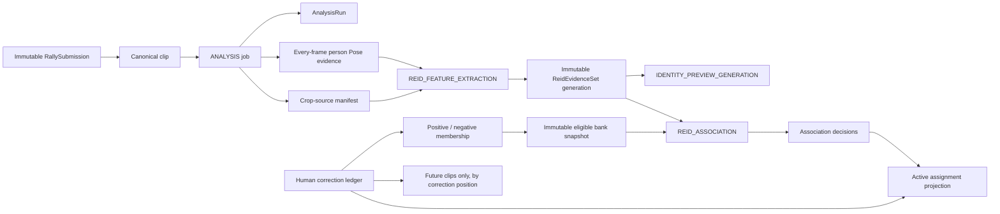

# ReID evidence, human correction, and rerun guide

Status: implementation guide for the ADR 0037 baseline
Last verified: 2026-08-16
Applies to: Central server, workflow worker, provider SDK, analysis engine, database, and annotation UI

This guide explains the implemented ReID architecture and operator behavior. It does not claim that
the source is deployed, that a provider capability is enabled in production, or that field accuracy
has improved. Capability rollout, real GPU measurements, migration rehearsal, and controlled
accuracy evaluation remain separate gates.

The full playback/annotation User Flows and stable rule IDs are in
[`ANNOTATION_WORKSTATION_USER_FLOWS_AND_REID_EVOLUTION.md`](./ANNOTATION_WORKSTATION_USER_FLOWS_AND_REID_EVOLUTION.md).
The architectural authority is
[`ADR 0037`](./adr/0037-versioned-reid-evidence-and-provider-work.md).

## The model in one picture

The important separation is:

- raw media, Pose, crops, descriptors, and VLM responses are immutable evidence;
- an association run is one reproducible interpretation of an explicit evidence set and bank;
- a correction is an append-only human decision;
- an active projection is the current effective answer used by UI/replay/analytics; and
- a roster player is not a run-local TID, a legacy L1–R6 slot, or an association group.

## Durable job boundaries

| Job kind                      | Reads                                                                      | Writes                                                                                         | Does not do                                                             |
| ----------------------------- | -------------------------------------------------------------------------- | ---------------------------------------------------------------------------------------------- | ----------------------------------------------------------------------- |
| `ANALYSIS`                    | canonical clip and immutable submission anchors                            | AnalysisData, analysis manifest, crop-source manifest, every-frame person-Pose manifest/chunks | activate ReID identity                                                  |
| `REID_FEATURE_EXTRACTION`     | clip, AnalysisData, crop source, saved Pose, roster snapshot               | versioned descriptors, selected frames, VLM raw-response evidence, tracklets                   | rerun detector/tracker/court/ball/action/Pose or assign a roster player |
| `REID_ASSOCIATION`            | one evidence generation, one exact eligible-bank snapshot, roster snapshot | candidates, confidence, resolved/review/unresolved decisions                                   | mutate evidence or overwrite manual projection                          |
| `IDENTITY_PREVIEW_GENERATION` | clip, exact track ID, crop source, saved Pose, selected frames             | animated WebP decision aid                                                                     | load a Pose model or change identity                                    |
| contact association           | changed contact frame plus saved Pose/ball/action/bbox evidence            | reviewed hitter projection and audit provenance                                                | rerun a vision model                                                    |

Provider WebSocket messages are control-plane offers, leases, progress, and acknowledgements. Media
and large artifacts use verified object-storage inputs and outputs. Each request has an explicit
schema version, work kind, idempotency key, callback token, artifact hash, and capability
requirement. Duplicate delivery and callback retry converge on the same durable job.

## Every-frame Pose and hitter correction

Base analysis accounts for every canonical frame/player observation. A row either contains COCO-17
person Pose with source bbox/crop transform/model namespace/confidence, or an explicit missing
reason. Court layout keypoints remain a different evidence type.

When a user moves a contact time:

1. the review revision records the new canonical frame;
2. a local durable contact-association job reads that exact saved frame;
3. reliable ball-to-wrist/forearm geometry is ranked first;
4. ambiguous or missing Pose falls back to action-aware bbox, generic bbox, then unresolved;
5. the projection records mode, scores, quality, and fallback reason; and
6. no detector, tracker, Pose, feature, or association job is started.

## Vector storage and later-clip history

Authoritative descriptor bytes remain in content-addressed object-storage artifacts. PostgreSQL
stores byte ranges, hashes, modality/model namespace, normalization/distance, source frames,
membership, bank snapshots, corrections, runs, and active projections.

The database image includes pgvector. Compact compatible descriptors are also materialized into
`ReidSearchEmbedding`:

- DINO 384-D and OSNet 512-D can use dimension-specific cosine HNSW expression indexes;
- the complete artifact remains authoritative and reproducible;
- 4096-D KPR/KPR Prompt descriptors are not forced into the 2,000-D `vector` HNSW limit; and
- pgvector is retrieval infrastructure, not the person identity authority.

For a later clip at `(set, rally)`, the bank builder selects only active confirmed memberships from
strictly earlier positions for the same match/team. It writes one immutable snapshot containing
cluster/roster candidates, vector-to-artifact byte ranges, positive/negative roles, weights, source
revisions, and cannot-link constraints. The provider receives that snapshot by hash and never reads a
moving implicit history.

## Human correction presets

| UI preset        | Effective projection                                                                      | Future feature bank                                              | Earlier clips |
| ---------------- | ----------------------------------------------------------------------------------------- | ---------------------------------------------------------------- | ------------- |
| `from_here`      | append manual projection for the current semantic track and applicable known later tracks | append source-negative and target-positive confirmed memberships | unchanged     |
| `split_identity` | append a manual projection for this clip's separated group                                | reject wrong source and confirm selected target evidence         | unchanged     |
| `clip_only`      | append only this clip's manual projection                                                 | no membership change                                             | unchanged     |

Manual assignment revisions use priority 1000; AI projections use priority 100. Association
materialization checks the semantic canonical track across evidence generations, not only a new
tracklet UUID. A late or rerun AI result therefore cannot overwrite a human result.

Corrections lock and advance `Match.identityRevision`. They append `ReidIdentityCorrection`,
`ReidAssignmentRevision`, `ReidEvidenceMembership`, and `ReidActiveProjection` changes in one
transaction. Raw evidence is never edited.

### Player 1 / Player 2 example

Suppose clip A correctly maps evidence to Player 1, while clip B was wrongly grouped with Player 1
but should be Player 2.

1. The operator selects Player 2 on B and chooses `from_here` or `split_identity`.
2. A is earlier than the correction anchor, so its projection and history are not rewritten.
3. B gets a new manual projection to Player 2.
4. B's membership under Player 1 is superseded/rejected; a confirmed positive membership under
   Player 2 is appended.
5. Already-analyzed clips after B whose bank revision is stale receive new association runs.
6. A slow old-bank result is retained as history but fails the current revision check and cannot
   update the active projection.
7. Future clips receive snapshots without the superseded wrong membership and with corrected
   eligible evidence.

## Three different UI actions

### 套用既有關聯

No model work. It projects already-known active relationships onto unresolved Local/TIDs and
preserves manual mappings.

### 重新配對

Creates an idempotent `ReidAssociationRerunRequest`. It reuses active feature evidence, saved Pose,
and an exact immutable bank snapshot. Team sides are tracked independently. The request completes
only after every side with eligible tracklets has a completed run.

### 重新取特徵

Creates an idempotent `ReidFeatureRebuildRequest` and a new feature-extraction job. It reuses the
canonical clip, AnalysisData, crop-source manifest, and saved every-frame Pose.

The new generation activates only when it covers the same canonical track set as the current one.
On activation:

- the old generation is marked superseded but retained;
- manual projections are copied to matching canonical tracks;
- active positive/negative memberships are superseded by rows pointing at the new descriptors and a
  new identity revision; and
- association/preview scheduling ignores superseded generations.

If coverage differs or materialization fails, the current generation remains active. A failed
rebuild cannot erase a working identity view.

## Dynamic preview

The preview request includes the canonical track ID and exact saved Pose manifest. Selected frames
come from feature/VLM evidence with a bounded deterministic fallback. The engine validates manifests,
crops the intended tracked person, and emits an animated WebP without loading Pose. An authenticated
match-scoped route streams the result. Browser full-frame extraction remains a fallback, and preview
failure never disables assignment.

## Recovery and no-stuck rules

- Corrections commit synchronously and do not wait for an AI worker.
- Feature and association rerun requests remain durable while workers are offline.
- Provider/terminal materialization failure transitions the matching request to `FAILED`.
- Lease expiry and retryable materialization return work to a retryable state.
- UI polling failure shows a temporary state and retries; the player combobox stays editable.
- Association uses the newest applicable bank revision; older network results cannot move the active
  projection.
- Evidence cutover occurs only after complete validation; prior artifacts remain auditable.

## Source map

- contracts: `packages/contracts/ai/` and `packages/contracts/examples/ai/`
- persistence: `packages/db/prisma/schema.prisma` and `20260815*`/`20260816*` migrations
- provider work: `server/src/realtime/provider-work-ws.ts`,
  `server/src/routes/provider-job-callback.ts`, `server/src/services/provider-jobs.ts`
- correction ledger: `server/src/services/reid-identity-ledger.ts`
- rerun APIs: `server/src/services/reid-feature-rebuild.ts`,
  `server/src/services/reid-association-rerun.ts`
- workers: `worker/src/roles/reid-feature-worker.ts`,
  `worker/src/roles/reid-association-worker.ts`, `worker/src/roles/identity-preview-worker.ts`
- UI: `web/app/components/AnnotationIdentityPanel.vue`,
  `web/app/components/PlayerIdentityPreview.vue`
- provider engine: `H:/Repos/volleyball-analysis-engine/src/volleyball_analysis_engine/`

## Remaining rollout and quality gates

The implementation alone does not prove:

- production cross-clip/same-clip accuracy or calibrated auto-activation thresholds;
- real GPU latency, throughput, and memory with every-frame Pose plus VLM;
- backup/restore and migration rehearsal on production-sized data;
- browser behavior against a deployed capability-enabled provider; or
- bulk merge, quarantine, atomic swap, and a complete side-by-side evidence review UI.

Do not convert the reported “about 50%” observation into a new claim until legacy,
appearance-only, VLM-only, and combined paths are measured on the same frozen protocol.
