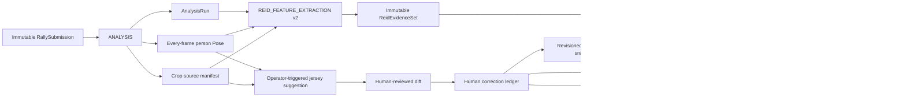

# ReID、人工修正與背號感知操作指南

Status: ADR 0044 的現行實作指南
Last verified: 2026-08-17
Applies to: Central server、workflow worker、provider SDK、analysis engine、database、annotation UI

本文件是後續 agent 修改球員身分功能時的現行基準。舊的固定六槽、ReID worker 內嵌
VLM、`NEEDS_REVIEW` 才能啟用 GID、以及「完成球員指派」門檻都不是相容需求。架構決策
以 [`ADR 0044`](./adr/0044-active-unbound-gids-revisioned-corrections-and-central-jersey-assistance.md)
為準；完整標註與播放 User Flow 在
[`ANNOTATION_WORKSTATION_USER_FLOWS_AND_REID_EVOLUTION.md`](./ANNOTATION_WORKSTATION_USER_FLOWS_AND_REID_EVOLUTION.md)。

## 1. 核心目標

- 每個有效 Local ID 都有 active GID；辨識弱時建立 active、unbound GID，不卡 review。
- GID 是跨片段的視覺人物群組，不是球員、背號、左右場固定槽或同時在場六人之一。
- GID 可不綁球員。只標多少就立即使用多少，沒有全部標完或完成鎖定按鈕。
- 不同時間出現、沒有共存的 Local/GID 可以綁同一位 roster player。
- 同一 frame 共存的 Local 不得投影為同一球員；衝突只能明確交換、拆分或 Local-only。
- 自動 evidence 與人工確認 evidence 分級。自動 GID 可供後續低權重比對，但不是人工真值。
- 原始影片、tracking、Pose、crop、descriptor 不因人工修正而改寫。
- 修正預設只影響修正點與之後；之前片段維持當時的投影與可稽核歷史。

## 2. 資料與工作流程



### 2.1 Local、GID、Player 三層不可混用

| 層級               | 範圍               | 會不會跨片段 | 是否必須存在                          | 權威資料                                |
| ------------------ | ------------------ | ------------ | ------------------------------------- | --------------------------------------- |
| Local/TID          | 單一 `AnalysisRun` | 否           | tracking 有人物時存在                 | `ReidTracklet` / raw AnalysisData       |
| GID/person cluster | match + team       | 是           | 每個 eligible Local 必須有 active GID | membership + assignment revisions       |
| roster player      | match roster       | 是           | 否                                    | revisioned GID binding / Local override |

`ReidPersonCluster.canonicalRosterEntryId` 是目前值的 read projection，不是歷史權威。
歷史權威是 `ReidGidRosterBindingRevision`。同一位 roster player 可以出現在多個不共存 GID；
資料庫不使用唯一索引禁止此狀況。

### 2.2 自動 association

1. Central 以一個 immutable evidence generation 與明確 bank revision 建立 job。
2. Provider 只讀 DINO、OSNet、KPR/KPR Prompt、cannot-link、team 與 soft occupancy prior。
3. 強且合法的候選回傳 `MATCH_EXISTING_GID`。
4. 其餘一律回傳 `CREATE_NEW_GID`；不回傳 review gate，也不讓 Local 沒有 GID。
5. 同片段、非共存且外觀非常接近的 Local 可共享同一個 new-GID group；Central 再次驗證
   cannot-link，Provider 不能繞過硬衝突。
6. 自動 membership 寫成 `UNVERIFIED` 並以保守權重進 bank。人工確認後才升為
   `CONFIRMED`/高權重。GID 的 active 狀態不依賴 evidence trust 狀態。
7. 人工 projection priority 是 1000，自動是 100。舊 job、重跑或晚到 callback 都不能蓋掉
   人工修正。

### 2.3 六人與場側

六人只是一個 soft on-court occupancy prior：

- 短暫辨識七人時，第七個有效 Local 仍建立 GID，不刪除、不偷用、不位移既有 GID。
- 少辨識一人時只是少一個觀測，不做槽位補位。
- 同 frame 共存是硬 cannot-link；六人數量不是硬限制。
- court side/team 取穩定時間聚合，短暫飄移不能改寫人物歷史。
- `court_side=UNKNOWN` 不猜隊伍；Central 直接建立 team-null 的 active unbound GID，等人工指派時再確定隊伍。
- match-long GID 數量可以大於六，包含替補、自由球員、false split 與待人工修正群組。

## 3. Durable job 邊界

| 工作                          | 讀取                                | 寫入                                                                 | 絕不做                               |
| ----------------------------- | ----------------------------------- | -------------------------------------------------------------------- | ------------------------------------ |
| `ANALYSIS`                    | canonical clip、submission anchors  | AnalysisData、tracking、court、ball、every-frame Pose、crop manifest | 指派 roster player                   |
| `REID_FEATURE_EXTRACTION v2`  | clip、AnalysisData、saved Pose/crop | descriptor bundle、tracklets、cannot-link                            | VLM、重跑 Pose、球員指派             |
| `REID_ASSOCIATION v2`         | evidence set、exact bank snapshot   | match/new-GID decisions                                              | 修改 raw evidence、蓋人工 projection |
| `IDENTITY_PREVIEW_GENERATION` | clip、track、saved Pose/crop        | animated preview                                                     | 載入 Pose 模型、修改身分             |
| Central jersey suggestion     | clip、saved Pose、tracklet、roster  | montage、raw API response、suggestion/diff                           | 自動套用、改 ReID descriptor         |

重新取特徵只建立新的 evidence generation；重新配對只使用既有 generation。兩者都不重跑
detector、DeepEIOU、SAM3、court、ball、action 或 Pose。

## 4. 人工操作 User Flow

### 4.1 一般指派

1. 使用者可用 Local view 或 GID view 操作。
2. 點整個 Local row 跳到該 track 出現的回合；Select 保留球員預覽。
3. 選擇球員後立即寫 revision，無需按「完成」。
4. 未指派的 Local 保持 active unbound GID；replay、標註、其他已標資料照常可用。
5. 面板只顯示 `已指派 X/Y` 與人工確認數，這是資訊，不是門檻。

### 4.2 修正選項

| UI 選項                    | Local→GID       | GID→player          | 目前 Local 顯示 | 後續 bank                     | 過去片段 |
| -------------------------- | --------------- | ------------------- | --------------- | ----------------------------- | -------- |
| 只重綁目前 GID             | 不變            | 從目前回合起改綁    | 改變            | 確認目前 GID evidence         | 不變     |
| 與指定 GID 交換球員        | 不變            | 兩個 GID 原子交換   | 兩邊改變        | 各自沿用修正後標籤            | 不變     |
| 只有這個 Local 的 GID 判錯 | 建立/移到新 GID | 目標 GID 綁所選球員 | 改變            | reject 錯來源、confirm 新來源 | 不變     |
| 只改這個 Local 顯示        | 不變            | 不變                | 改變            | 不納入學習                    | 不變     |

### 4.3 同 frame 衝突

若所選球員已被同 frame 的另一個 Local 使用：

- 不允許兩個共存 Local 綁同一球員。
- UI 顯示目標 GID，預設選項是原子交換兩個 GID 的 roster binding。
- 不提供「拆成另一個 GID 但仍綁同一球員」的矛盾操作。
- 可選 Local-only，表示只修畫面投影且不餵給後續 bank。
- Server 再做一次 cannot-link/同場驗證，不能只依賴前端 disabled 狀態。

### 4.4 非共存與跨片段 GID

若另一個 GID 只在別的時間出現，兩個 GID 綁同一球員是合法情形；系統不能自動解除舊
GID。當目前 GID 已綁其他球員且使用者選擇新球員時，UI 額外列出這位球員既有的 GID：

- 選「只重綁目前 GID」：保留其他 GID，允許同一球員有多個 false-split GID。
- 選「與 GID X 交換」：明確執行跨片段 GID label swap。
- 沒有明確選擇時不得猜測交換目標，因為同一球員可能合法擁有多個非共存 GID。

## 5. 背號感知

背號感知不是 ReID Provider Work，也不是 worker 常駐模型。它是使用者按下「背號感知」
才建立的 Central durable job。

### 5.1 取樣與 API

1. 讀取該 `AnalysisRun` 已保存的 every-frame person Pose。
2. 依 shoulders/hips confidence、bbox 面積與 torso 可見度產生品質分數。
3. 每個 Local 取品質最高的 40 張候選池，再以 run/track/frame seed 做可重現的隨機排序。
4. 最多取 10 張，依 Local bbox 裁切並拼成一張 montage。
5. 呼叫 OpenAI-compatible `POST {BASE_URL}/chat/completions`，要求 JSON object。
6. 模型只能從該隊 roster 背號中選擇或回 null；同背號在名單中不是唯一時不自動對應球員。

環境設定：

```text
JERSEY_VISION_API_KEY=
JERSEY_VISION_BASE_URL=https://api.openai.com/v1
JERSEY_VISION_MODEL=gpt-4.1-mini
JERSEY_VISION_TIMEOUT_MS=120000
JERSEY_VISION_MAX_TOKENS=300
```

沒有 API key 時 job 明確失敗為 `JERSEY_VISION_NOT_CONFIGURED`，不影響 ReID、Pose 或人工
Select。API 429/5xx/timeout 依 lease/retry policy 重試；單一 Local 無可用 torso frame 時只標記
該 item 失敗。

### 5.2 Diff review

- job 完成後才自動開啟差異 dialog。
- 每列顯示 Local/GID、目前球員、建議背號/球員、confidence 與是否可套用。
- 預設勾選「有唯一 roster 對應且真的有差異」的項目；使用者可逐筆取消。
- Hover 每列顯示既有 animated Local preview 與本次 top-10 montage。
- 套用以 suggestion id 逐筆寫人工 `from_here` revision；未選、失敗、無唯一對應與已套用項目
  都保持原狀。
- 若建議遇到同 frame 人物衝突，該筆不覆寫，回到 Local 列表由使用者決定交換或 Local-only。

## 6. 向量、學習與錯誤特徵

- descriptor 原始 bytes 存 content-addressed object storage；PostgreSQL 保存 byte range、hash、
  modality、model namespace、source frames 與 membership revision。
- DINO 384-D、OSNet 512-D 可投影到 pgvector/HNSW；大型 KPR 向量仍以 artifact 為權威。
- later-clip bank 是明確 immutable snapshot，不直接讀會變動的「目前資料庫全部向量」。
- `UNVERIFIED` 自動 membership 可以低權重提供候選；人工正確指派建立 `CONFIRMED POSITIVE`。
- GID/Local 修正對錯來源建立 superseding membership 與 negative/rejected evidence，使後續 snapshot
  不再把錯特徵當該球員正樣本。
- `clip_only` 只修 projection，不改 membership，適合畫面修正但證據不可靠的情形。
- 大模型 fine-tune 不在 request path；NPA/小型 adaptation 必須綁定 exact snapshot、seed 與 recipe，
  且只能使用 eligible confirmed/weighted evidence。

## 7. 已知限制與防護

- 非共存不等於同一人，只代表「可以比較/合併」，不是正證據。
- 兩個真的不同的人若外觀相近仍可能錯 merge；same-frame cannot-link 能阻止最危險情形，人工
  split/move 負責修復其餘情形。
- 暫時超過六個偵測可能增加 unbound GID，這是可清理的 false split；不能為了維持六個而
  造成 false merge 或遺失 Local。
- `identity_mapping_completed` 是舊 read projection；新 UI/操作與下游不可依賴它。
- 本改版不宣稱線上 ReID accuracy 已提升。必須用同一 frozen protocol 分別量測 same-clip、
  cross-clip、false merge、fragmentation、人工修正率與後續 bank 汙染率。

## 8. Source map

- ADR：`docs/adr/0044-active-unbound-gids-revisioned-corrections-and-central-jersey-assistance.md`
- contracts：`packages/contracts/ai/reid-feature-*`、`reid-association-*`
- persistence：`packages/db/prisma/schema.prisma` 與 `20260817140000*` migration
- association materializer：`worker/src/roles/reid-association-worker.ts`
- jersey job：`worker/src/roles/jersey-suggestion-worker.ts`
- correction ledger：`server/src/services/reid-identity-ledger.ts`
- jersey API：`server/src/services/reid-jersey-suggestions.ts`
- GraphQL：`server/src/graphql/coach-analytics.ts`
- UI/controller：`web/app/components/AnnotationIdentityPanel.vue`、
  `IdentityJerseySuggestionDialog.vue`、`identity-assignment-controller.service.ts`
- external provider：`H:/Repos/volleyball-analysis-engine/src/volleyball_analysis_engine/`
